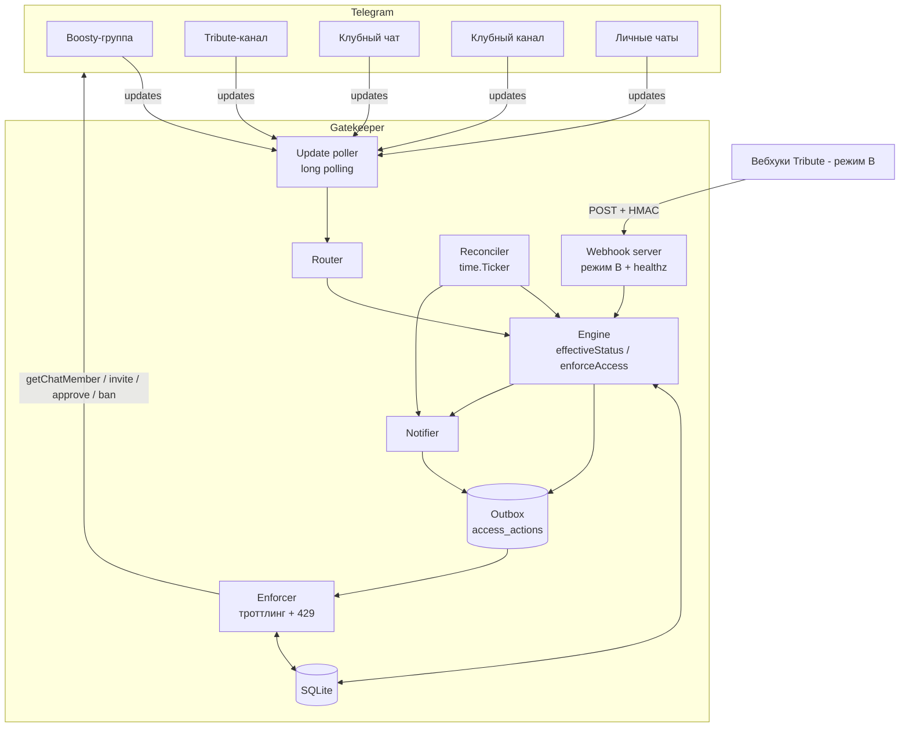

# Gatekeeper — спецификация реализации

> Telegram-бот контроля доступа к платным ресурсам одного автора.
> Источники подписки — **Boosty** и **Tribute**. Управляемые ресурсы —
> отдельные закрытый **чат** и закрытый **канал** автора.
> Язык реализации — **Go**. Хранилище — **SQLite**.

**Версия:** 1.3 — durable inbox state machine для telegram_updates
**Дата:** 2026-05-25
**Лицензия:** MIT — проект распространяется как open-source, self-hosted.
**Статус:** декларативная продуктово-техническая спецификация готового
приложения. Документ описывает, *что* система делает и *почему*; нарезка
на этапы выполнения — отдельная задача.

Рядом лежит `MERGE-NOTES.md` — обоснование решений слияния в формате
ADR. Он нужен для аудита выбора, а не для реализации: реализовать
достаточно `SPEC.md`.

---

## Как читать этот документ

Документ **самодостаточен**: его должен полностью понять исполнитель
(человек или агент) без какого-либо предварительного контекста о проекте.

- Прозаическая часть — на **русском**. Весь код, идентификаторы, имена
  таблиц и полей, SQL, методы API, переменные окружения — на **английском**.
  Примеры сообщений бота — на **русском** (аудитория русскоязычная).
- Разделы 1–7 — концептуальная основа: задача, термины, сущности,
  внешние интеграции и факты, на которых построен дизайн.
- Разделы 8–17 — техническое ядро: архитектура, доменная модель, схема
  БД, логика, сценарии, интерфейс, обработка событий.
- Разделы 18–28 — инженерная обвязка: конфигурация, стек, надёжность,
  безопасность, наблюдаемость, корнер-кейсы, тестирование, развёртывание,
  критерии приёмки, открытые вопросы и приложение с фактами ресёрча.

Это спецификация **готового приложения**, а не прототипа: она намеренно
подробна. Каждая деталь — по делу; декоративных разделов нет.

---

## 1. Краткое резюме

Автор платного контента монетизирует аудиторию через две платформы:

- **Boosty** (boosty.to) — платформа подписок (аналог Patreon, владелец —
  VK). У автора есть приватная Telegram-**группа**, в которую официальный
  бот Boosty (`@boosty_to_bot`) автоматически добавляет оформивших
  подписку и удаляет тех, у кого она истекла.
- **Tribute** (tribute.tg, бот `@Tribute`) — платформа монетизации внутри
  Telegram. Подписчики платят через Tribute, и Tribute даёт им доступ в
  приватный Telegram-**канал**, которым управляет сам.

Автор хочет **единое закрытое сообщество** — отдельные клубные чат и
канал — доступ к которым получают подписчики **с любой из двух платформ**.

**Gatekeeper** — бот, который:

1. определяет, есть ли у конкретного Telegram-пользователя активная
   подписка (Boosty и/или Tribute);
2. ведёт в SQLite учёт всех известных подписчиков — активных и
   неактивных, с историей периодов подписки;
3. по запросу пользователя в личке выдаёт ему доступ в клубный чат и
   клубный канал;
4. в фоне отслеживает истечение подписок и закрывает доступ тем, кто его
   потерял (с предупреждением и грейс-периодом);
5. сохраняет полный audit trail: почему доступ был выдан, продлён или
   отозван.

### 1.1. Поток данных (обзор)

```text
   ┌─ Boosty source group ─┐         ┌─ Tribute source channel ─┐
   │ (управляет @boosty_to_bot)      │ (управляет @Tribute)      │
   └──────────┬────────────┘         └───────────┬──────────────┘
              │ chat_member                      │ chat_member
              │                                  │  + (опц.) вебхуки Tribute
              ▼                                  ▼
        ┌─────────────────────────────────────────────────┐
        │                  GATEKEEPER BOT                  │
        │  update router → engine (effectiveStatus /        │
        │  enforceAccess) → outbox → Enforcer (троттлинг)   │
        │  reconciler ─┘            SQLite ─┘                │
        └───────────────┬─────────────────────┬─────────────┘
        invite / approve │                     │ ban / DM
                         ▼                     ▼
              ┌─ Клубный чат ─┐      ┌─ Клубный канал ─┐
              │ (управляет наш бот)  │ (управляет наш бот)
              └───────────────┘      └─────────────────┘
```

### 1.2. Ключевые решения (сводка; обоснования — разделы 5–7)

| Решение | Кратко |
|---|---|
| Источник Boosty | Наблюдение за членством в Boosty-группе через Telegram Bot API. Прямой API Boosty **не используется** (нет привязки к Telegram ID, нестабилен). |
| Источник Tribute | Базово — наблюдение за членством в Tribute-канале (режим A, без инфраструктуры). Опционально — официальные вебхуки Tribute (режим B, точные даты `expires_at`). Членство всегда остаётся страховочным сигналом. |
| Идентичность | Всё завязано на Telegram user ID. Промежуточная привязка аккаунтов не нужна. |
| Транспорт Telegram | Long polling (публичный адрес не нужен). Вебхук — опциональная альтернатива. |
| Выдача доступа | Режим инвайтов настраивается: по умолчанию `shared_join_request`; опционально `personal_join_request`; `direct` — только аварийный fallback. |
| Удаление | Soft-kick: `banChatMember` + `unbanChatMember` — удалён, но может вернуться после новой подписки. |
| Безопасность логики | Трёхзначный статус `ACTIVE / INACTIVE / UNKNOWN`. Отзыв доступа — только при достоверном `INACTIVE`; `UNKNOWN` доступ не трогает. |
| Надёжность | Durable outbox: все действия в Telegram переживают рестарт, идемпотентны, ретраятся. |
| Хранилище | SQLite (WAL), один файл, чистый Go без cgo. |

---

## 2. Цели, не-цели и инварианты

### 2.1. Цели

Система должна:

- определять наличие активной подписки конкретного Telegram-пользователя
  через Boosty и/или Tribute;
- вести в БД учёт **всех** известных подписчиков — активных, неактивных,
  ушедших, заблокированных, добавленных вручную — с историей периодов;
- по запросу пользователя в личке выдавать доступ в клубный чат и
  клубный канал;
- в фоне отзывать доступ, когда все основания для него закончились —
  предварительно предупредив пользователя (грейс-период);
- хранить audit trail, объясняющий каждое решение о доступе;
- быть устойчивой к дубликатам и потерям событий, к перезапускам и к
  временной недоступности внешних систем;
- давать администратору внятный ответ на вопрос «почему у пользователя
  есть/нет доступ».

### 2.2. Не-цели (сознательно вне области)

- Бот **не** обрабатывает платежи — это делают Boosty и Tribute.
- Бот **не** заменяет Boosty/Tribute как биллинговые системы.
- Бот **не** скрейпит неофициальный API Boosty в продакшене (§6.1).
- Бот **не** управляет членством в Boosty-группе и Tribute-канале — он
  их только наблюдает.
- Бот **не** доставляет контент, не ведёт рассылки, не является CRM.
- Single-tenant: один автор, один источник Boosty, один источник
  Tribute, один клубный чат, один клубный канал.
- Уровни подписки (tiers) **не** дают разный доступ: любая активная
  подписка → единый доступ к обоим ресурсам. (`tier` сохраняется в БД
  для учёта; дифференциация — задокументированное расширение, §28.4.)
- В v1 **не** вводится слой `entitlements` / `access_scopes` /
  `grant_rules`: для единого доступа это лишний rule engine. Путь
  миграции к нему описан отдельно (§28.4).

### 2.3. Инварианты

Сквозные правила, которые должны соблюдаться всегда. Реализация и
код-ревью опираются на их номера.

1. **Идентичность пользователя — Telegram user ID** (`int64`).
   Промежуточная привязка внешних аккаунтов не нужна и не делается.
2. У пользователя может быть **несколько активных источников
   одновременно**; доступ есть, пока активен хотя бы один.
3. Чтобы **выдать** доступ — достаточно одного достоверного `ACTIVE`.
   Чтобы **отозвать** — нужно, чтобы все источники достоверно сказали
   `INACTIVE`.
4. **Неопределённость (`UNKNOWN`)** — сбой сети, таймаут, потеря
   админ-прав — **никогда не ведёт к отзыву** доступа. Fail-open для
   платящего подписчика.
5. **Hard-ban** владельцем сильнее любой подписки. **Whitelist** сильнее
   отсутствия подписки.
6. Все обработчики событий, вебхуков и фоновых действий **идемпотентны**:
   повтор не меняет итог.
7. Временная ошибка внешнего API **≠** окончание подписки.
8. **БД — источник истины о доступе, который выдал бот.** Платформа —
   источник истины об оплате. Членство в источнике-чате — наблюдаемый
   сигнал. Бот никогда не пишет в источники-чаты (только читает).
9. Бот **отзывает** доступ только у тех, кого сам впустил
   (`admitted_by='bot'`), либо по явной команде администратора. Чужих
   участников клубных ресурсов он не трогает (только сообщает владельцу).
10. **Создателей и администраторов** клубных ресурсов бот не удаляет
    автоматически (Telegram и не позволил бы).
11. В штатных режимах (`shared_join_request`, `personal_join_request`)
    инвайт-ссылка только создаёт join-request: финальный шлагбаум —
    живая проверка подписки перед `approve`. Утечка ссылки не даёт
    доступа без подписки.
12. `direct`-ссылка не является штатным режимом. Она включается только
    осознанно, с коротким TTL, аудитом и последующей сверкой членства.
13. **Тариф и источник не влияют на объём доступа.**
    `subscriptions.tier` хранится только для учёта; `effectiveStatus` и
    `enforceAccess` на тариф и платформу **никогда не ветвятся**. Любая
    достоверно активная подписка — Boosty, Tribute или ручная, любого
    тарифа — даёт единый доступ к обоим клубным ресурсам. Дифференциация
    по тарифам/источникам — задокументированный путь миграции (§28.4),
    в v1 её нет.
14. Все доменные действия в Telegram (кик, approve/decline,
    создание/отзыв ссылок, DM) проходят через **durable outbox** с
    идемпотентным ключом и переживают рестарт процесса.

---

## 3. Глоссарий

| Термин | Значение |
|---|---|
| **Источник** (source) | Платформа-основание доступа: `boosty`, `tribute` или `manual` (ручная выдача). |
| **Источник-чат** | Telegram-группа/канал, которым управляет бот платформы; членство в нём = факт активной подписки. Наш бот его **наблюдает**. |
| **Boosty-группа** | Приватная супергруппа под управлением `@boosty_to_bot`. Источник-чат для `boosty`. |
| **Tribute-канал** | Приватный канал под управлением `@Tribute`. Источник-чат для `tribute`. |
| **Управляемый ресурс** / **клубный чат**, **клубный канал** | Закрытые чат и канал автора, доступ к которым **выдаёт и отзывает наш бот**. |
| **Подписчик / пользователь** | Telegram-пользователь, известный боту (виден в источнике, писал в личку, пришёл из вебхука или заведён администратором). |
| **Подписка** (subscription) | Запись о периоде подписки пользователя на одной платформе. У пользователя может быть несколько строк (история + разные источники). |
| **Доступ** (access grant) | Факт того, что бот выдал/выдаёт пользователю доступ к одному управляемому ресурсу. |
| **Вердикт** (verdict) | Ответ одного источника о пользователе: `ACTIVE` / `INACTIVE` / `UNKNOWN`. |
| **Эффективный статус** | Итог объединения вердиктов всех источников (§11.1). |
| **Грейс-период** | Время между обнаружением истечения подписки и фактическим удалением из ресурсов. |
| **Soft-kick** | Удаление из чата через `banChatMember` + `unbanChatMember(only_if_banned=true)` — человек удалён, но может вернуться. |
| **Hard-ban** | Постоянный бан без разбана — для злоупотреблений; перекрывает любую подписку. |
| **Реконсиляция** | Фоновая сверка реального состояния (членство, `expires_at`) с записями в БД — страховка от потерянных событий. |
| **Enforcer** | Компонент-исполнитель: единственная точка, делающая исходящие вызовы Telegram API, с троттлингом и обработкой лимитов. |
| **Outbox** | Durable-очередь действий в Telegram (`access_actions`): переживает рестарт, идемпотентна, ретраит. |
| **Owner / администратор бота** | Владелец, управляющий ботом через приватные команды (`OWNER_TG_IDS`). Не путать с администраторами Telegram-чатов. |
| `chat_member` | Тип обновления Telegram Bot API: изменился статус *любого* участника чата. |
| `my_chat_member` | Тип обновления: изменился статус *самого бота* в чате. |
| `chat_join_request` | Тип обновления: пользователь подал заявку на вступление. |
| `getChatMember` | Метод Bot API: статус одного пользователя в одном чате. |

---

## 4. Telegram-сущности и роли

Система оперирует **четырьмя** Telegram-чатами и **одним** ботом
(плюс личные переписки и опциональный лог-чат администратора).

| # | Чат | Тип Telegram | Кто управляет членством | Роль Gatekeeper | Права бота |
|---|---|---|---|---|---|
| 1 | **Boosty-группа** | приватная супергруппа | `@boosty_to_bot` | наблюдатель | администратор (достаточно статуса; конкретные права можно не выдавать) |
| 2 | **Tribute-канал** | приватный канал | `@Tribute` | наблюдатель (+ приёмник вебхуков в режиме B) | администратор (достаточно статуса) |
| 3 | **Клубный чат** | приватная супергруппа | **наш бот** | управляющий доступом | администратор: `can_invite_users` + `can_restrict_members` |
| 4 | **Клубный канал** | приватный канал | **наш бот** | управляющий доступом | администратор: `can_invite_users` + `can_restrict_members` |

> **Почему именно эти права.** `chat_member`-обновления Telegram
> присылает только администраторам — поэтому бот должен быть админом во
> **всех четырёх** чатах. В источниках-чатах больше ничего не нужно (бот
> там только читает). В клубных ресурсах нужны `can_invite_users`
> (создавать ссылки и одобрять заявки) и `can_restrict_members`
> (удалять при истечении).

**Опционально — `admin_log_chat`:** приватная группа/канал, куда бот
дублирует тревоги и важные уведомления для администратора. Если не
задан — уведомления идут в личку каждому из `OWNER_TG_IDS`.

**Требования к настройке:**

- Boosty-группа должна оставаться **группой/супергруппой** — Boosty
  принципиально не работает с каналами и секретными чатами.
- Tribute-канал — именно **канал**, как его создаёт Tribute.
- Клубный чат — **супергруппа** (не обычная группа: в обычной группе
  бан работает ненадёжно).
- Идентификаторы супергрупп и каналов — отрицательные `int64` вида
  `-100XXXXXXXXXX`.
- Источники-чаты и клубные ресурсы — **разные** сущности. Нельзя
  использовать Boosty-группу как клубный чат: `@boosty_to_bot` удалит
  оттуда тех, у кого нет Boosty-подписки, даже если у них активен
  Tribute.
- Режим приватности бота можно оставить включённым — он не влияет на
  служебные обновления `chat_member` / `my_chat_member` /
  `chat_join_request`.

ID чатов бот помогает получить сам: при добавлении в любой чат приходит
`my_chat_member` — бот логирует ID, тип, название и сообщает их владельцу
(§16.4). Дополнительно — команда `/here` (§15.3).

---

## 5. Ключевое архитектурное решение

**Всё завязано на Telegram user ID. Промежуточная привязка внешних
аккаунтов не нужна.**

- Членство пользователя в Boosty-группе даёт его Telegram user ID
  напрямую — из обновлений `chat_member` и из `getChatMember`.
- Членство в Tribute-канале — то же самое.
- Вебхук Tribute (режим B) содержит `telegram_user_id` напрямую.
- Когда пользователь пишет боту в личку — это **тот же** Telegram
  user ID.

Боты Boosty и Tribute уже сделали сложную часть: проверили оплату и
добавили/удалили *правильного* Telegram-пользователя в свой источник-чат.
Наш бот переиспользует результат их работы.

**Следствие.** Источник истины «есть ли у пользователя активная
подписка» — это **факт его членства в источнике-чате**, проверяемый
методом `getChatMember`. Это объясняет ключевые решения раздела 6: прямой
API Boosty непригоден (он не выдаёт Telegram ID подписчиков), а
наблюдение за членством работает для обоих источников единообразно.

Из этого решения вытекает и важное **ограничение**: точность нашего бота
по каждому источнику ограничена точностью бота платформы. Если
`@boosty_to_bot` удаляет лапснувшего подписчика с задержкой — наш бот
унаследует эту задержку (детали — §6.1).

---

## 6. Источники подписок: Boosty и Tribute

### 6.1. Boosty — наблюдение за группой (не API)

**Решение: бот наблюдает членство в Boosty-группе через Telegram Bot API.
Прямой API Boosty в продакшене не используется.** Это окончательное
решение, а не временный этап.

Обоснование (детали и ссылки — Приложение A.1):

- **Официального API у Boosty нет.** Неофициальный `api.boosty.to`
  существует, но:
  - **не отдаёт Telegram user ID подписчиков** — только внутренние
    Boosty-идентификаторы и email. Сопоставить их с Telegram-аккаунтом
    через API невозможно. Это решающий довод: API не способно ответить
    на главный вопрос системы — «какому Telegram-аккаунту дать доступ».
  - требует Bearer-токен, добываемый вручную из браузерной сессии
    живого человека; access-токен живёт ~1 ч, refresh ротируется и
    нестабилен (известный незакрытый баг);
  - схема ответа меняется примерно ежемесячно;
  - использование противоречит ToS Boosty и рискует аккаунтом автора.
- Boosty официально управляет приватной Telegram-**группой** через
  `@boosty_to_bot`: добавляет оформивших подписку, удаляет истёкших.
  С каналами и секретными чатами интеграция не работает. Третьего
  бота-администратора Telegram в группе допускает.

**Наследуемое ограничение.** Удаление истёкших у Boosty событийное, но
«синхронизация группы» гарантированно прогоняется лишь раз в **~4
недели**. Обычно лапснувшего подписчика бот Boosty убирает быстро, но
отдельные «застрявшие» могут висеть в группе до ~4 недель. Отзыв доступа
по Boosty не может быть быстрее, чем удаление у самого Boosty. Это
ограничение платформы; устранить его нельзя (точные даты истечения
недоступны — см. выше). Документируется в `/help` и в §28.

Неофициальный API Boosty допустим лишь как **опциональный, выключенный
по умолчанию** модуль reconcile/аналитики (`BOOSTY_UNOFFICIAL_API`,
§28) — никогда как основа авторизации.

### 6.2. Tribute — наблюдение за каналом + опциональные вебхуки

**Решение: поддерживаются два режима, выбираются конфигом
`TRIBUTE_MODE`. Членство в Tribute-канале — всегда базовый,
страховочный сигнал; вебхуки — опциональное обогащение.**

У Tribute, в отличие от Boosty, **есть официальный API с вебхуками**
(Приложение A.2). Поэтому — два режима:

**Режим A — `observation` (по умолчанию).** Только наблюдение членства в
Tribute-канале — механизм идентичен Boosty. Не нужен публичный
HTTPS-эндпоинт, не нужен API-ключ. Точная `expires_at` неизвестна
(`NULL`). 7-дневный грейс Tribute при неудачном платеже учитывается
автоматически: пока Tribute держит человека в канале, `getChatMember`
видит его как `member`.

**Режим B — `webhook` (рекомендуется для продакшена при наличии
публичного HTTPS).** Дополнительно поднимается HTTP-сервер для приёма
вебхуков Tribute. Вебхуки дают: точную дату `expires_at` (можно показать
пользователю и заранее предупредить об истечении), тариф, сумму, тип
(`regular`/`gift`/`trial`), более раннее знание об отмене, и записи о
подписчиках ещё до того, как они написали боту.

**Важно:** даже в режиме B вебхуки **не отменяют** проверку членства.
Членство в Tribute-канале остаётся истиной в последней инстанции; вебхуки
обогащают БД и ускоряют реакцию. Это делает модель устойчивой к
пропущенным/дублированным вебхукам и к простоям эндпоинта.

**Семантика отмены.** Вебхук `cancelled_subscription` означает «не буду
продлевать», **не** «доступ закончился сейчас». Доступ действует до
`expires_at`. Отдельного события «истекло» Tribute не шлёт — момент
истечения вычисляется по `expires_at` фоновым процессом (§14).
Поведение настраивается флагом `TRIBUTE_CANCEL_IS_IMMEDIATE` (по
умолчанию `false`).

**Рекомендация по выбору режима.** Хостинг проекта на момент написания
спецификации не выбран. Стартовать можно в режиме `observation` (работает
где угодно, ноль инфраструктуры). Для полноценного продакшена, когда
появится постоянный публичный HTTPS-эндпоинт, рекомендуется перейти на
`webhook`: это даёт точные даты и проактивные предупреждения. Переключение
— смена одной переменной окружения плюс настройка URL в кабинете Tribute;
доменная модель, схема БД и логика **не меняются** (см. §6.3).

### 6.3. Нормализованная модель события

Оба источника (и оба режима Tribute, и ручная выдача) приводятся к
единому внутреннему типу `SubscriptionEvent`. Ядро системы не знает,
откуда пришло событие.

```go
// Platform — платформа-источник.
type Platform string

const (
    PlatformBoosty  Platform = "boosty"
    PlatformTribute Platform = "tribute"
    PlatformManual  Platform = "manual"
)

// EventKind — нормализованный вид события.
type EventKind string

const (
    EventActivated   EventKind = "activated"   // подписка появилась/активна
    EventDeactivated EventKind = "deactivated" // подписка пропала/истекла
)

// SubscriptionEvent — нормализованное событие подписки из любого источника.
type SubscriptionEvent struct {
    Platform   Platform
    Kind       EventKind
    TGUserID   int64
    TGUsername string     // опционально
    Tier       string     // опционально (subscription_name у Tribute)
    ExpiresAt  *time.Time // известно только для Tribute в режиме B и для manual
    ExternalID string     // tribute subscription_id и т. п.
    PeriodID   string     // tribute period_id
    OccurredAt time.Time
    Raw        []byte     // сырой payload для аудита
}
```

| Источник / событие | → `SubscriptionEvent` |
|---|---|
| Вступление в Boosty-группу (`chat_member`) | `boosty, Activated` |
| Выход/удаление из Boosty-группы | `boosty, Deactivated` |
| Вступление в Tribute-канал (режим A) | `tribute, Activated` |
| Выход из Tribute-канала (режим A) | `tribute, Deactivated` |
| Вебхук `new_subscription` / `renewed_subscription` (режим B) | `tribute, Activated, ExpiresAt=…` |
| Вебхук `cancelled_subscription` (режим B) | особый случай — фиксируется отмена, доступ жив до `expires_at` (§11.2) |
| Истечение `expires_at` (фоновая сверка) | `tribute, Deactivated` |
| Команда `/grant` владельца | `manual, Activated` |
| Команда `/revoke` владельца | `manual, Deactivated` |

---

## 7. Факты Telegram Bot API, на которые опирается дизайн

Реализующему агенту это нужно знать заранее. Сводка с источниками —
Приложение A.3.

1. **`chat_member`** (изменение статуса *другого* пользователя в чате)
   приходит, **только если бот — администратор** чата **и** тип
   `chat_member` явно указан в `allowed_updates`. По умолчанию исключён.
2. **`my_chat_member`** (изменение статуса *самого бота*; в личке —
   блокировка/разблокировка бота пользователем) приходит всегда,
   админ-права для этого не нужны.
3. **`allowed_updates`** по умолчанию исключает `chat_member`. Передавать
   нужно **полный явный список**:
   `["message","callback_query","my_chat_member","chat_member","chat_join_request"]`.
4. `chat_member` **работает и для каналов**, где бот — администратор,
   не только для супергрупп.
5. **`getChatMember(chat_id, user_id)`** работает и для супергрупп, и для
   каналов; для чужих пользователей бот обязан быть админом. Возвращает
   `ChatMember` со `status`:
   - `creator`, `administrator`, `member` → пользователь **в чате**;
   - `restricted` → только в супергруппах; смотреть поле `is_member`
     (`true` → в чате);
   - `left`, `kicked` → **не в чате**.
6. **Перечислить всех участников супергруппы/канала через Bot API
   НЕЛЬЗЯ.** Есть только `getChatMemberCount` (число) и
   `getChatAdministrators` (только админы). Поэтому бот ведёт
   собственную БД и проверяет пользователей точечно по их ID.
7. **Когда бота добавляют в чат с уже существующими участниками,
   `chat_member` по ним задним числом НЕ приходит.** Бэкафилла нет;
   старые участники становятся известны при первом своём событии или
   при первом обращении к боту.
8. **Доставка `chat_member` неидеальна:** по наблюдениям сообщества
   теряется заметная доля (порядка 15–20 %) таких обновлений. Поэтому
   события — быстрый сигнал, но не единственный; обязательна
   периодическая сверка через `getChatMember` (§14).
9. **Инвайт-ссылки.** `createChatInviteLink` с параметрами `name`
   (0–32 символа), `expire_date`, `member_limit` (1–99999),
   `creates_join_request`. `member_limit` и `creates_join_request` —
   **взаимоисключающие**. «Одноразовая» ссылка (`member_limit=1`)
   ограничивает лишь *одновременное* число вошедших — после выхода
   участника снова становится рабочей.
10. **Join-requests.** Ссылка с `creates_join_request=true`: клик →
    обновление `chat_join_request` → бот вызывает
    `approveChatJoinRequest` или `declineChatJoinRequest`. Для приёма
    этих обновлений боту нужно право `can_invite_users`. Работает и для
    супергрупп, и для каналов.
11. **`ChatJoinRequest.user_chat_id`** позволяет написать пользователю в
    личку даже если он не запускал бота — короткое окно после подачи
    заявки.
12. **Удаление участника.** Soft-kick: `banChatMember`, затем
    `unbanChatMember(only_if_banned=true)` — человек удалён, но не
    забанен и может вернуться позже. Только `banChatMember` без разбана
    в супергруппах/каналах **запрещает повторное вступление любым
    способом** до явного разбана.
    - В супергруппах и каналах бан **всегда удаляет сообщения**
      удаляемого (`revoke_messages` фактически принудительно `true`).
      Сообщения лапснувшего участника клубного чата при кике пропадут —
      неустранимое ограничение Bot API (см. §24, корнер-кейс, и §28).
    - Создателя и администраторов чата банить нельзя (ошибка 400) —
      перед киком проверять статус.
13. **Бот не может написать первым** пользователю, который не запускал
    личку с ботом (вне окна `user_chat_id`, п. 11). Попытка → ошибка
    `403`. Если пользователь заблокировал бота — тоже `403`.
14. **Хранение обновлений — 24 часа.** При простое бота < 24 ч обновления
    доставляются после рестарта; при простое > 24 ч пропущенные
    `chat_member` теряются безвозвратно → нужна сверка (§14).
15. **Режим приватности** бота влияет только на `message` в группах,
    **не** на `chat_member`/`my_chat_member`/`chat_join_request`.
16. **Лимиты.** ~30 сообщений/с глобально, ~1 сообщение/с в один чат,
    ~20 сообщений/мин в группу. Для read-методов (`getChatMember`)
    числового лимита нет — троттлить консервативно. На превышение —
    HTTP `429` с полем `retry_after` (число секунд); уважать его точно.

Транспорт для нашего бота — **long polling** (`getUpdates`): публичный
эндпоинт не нужен, устойчив к коротким простоям. Webhook для самого бота
— допустимая альтернатива (§19), но не обязателен. HTTP-сервер поднимается
отдельно и только для вебхуков Tribute в режиме B и для `healthz`/`readyz`.

---

## 8. Архитектура

### 8.1. Компоненты и поток данных



| Компонент | Зона ответственности |
|---|---|
| **Update poller** | Длинный опрос `getUpdates` с нужным `allowed_updates`; хранение и продвижение `offset`; запись сырых обновлений в `telegram_updates` для идемпотентности. |
| **Router** | Маршрутизация обновлений по типу и `chat.id`: источниковые `chat_member` → Engine как `SubscriptionEvent`; клубные `chat_member`/`chat_join_request` → Engine; личные сообщения/команды → bot-хендлеры; `my_chat_member` → health. |
| **Webhook server** | (Режим B) HTTP-сервер: приём вебхуков Tribute с проверкой HMAC-подписи и идемпотентностью; эндпоинты `healthz`/`readyz`. |
| **Engine** | Доменное ядро: `effectiveStatus`, `enforceAccess` (§11). Принимает решения, пишет состояние в БД, **ставит действия в outbox**. Сам сетевых вызовов Telegram не делает. |
| **Outbox** (`access_actions`) | Durable-очередь действий в Telegram. Запись действия и изменение доменного состояния — в одной транзакции БД. Переживает рестарт. |
| **Enforcer** | Единственный исполнитель доменных исходящих вызовов Telegram API (`getChatMember`, инвайты, approve/decline, ban/unban, `sendMessage`). Читает outbox, троттлит, обрабатывает `429`/ретраи. |
| **Reconciler** | Фоновый `time.Ticker`: ставит релевантных пользователей на перепроверку, исполняет отложенные отзывы, проверяет здоровье, чистит просрочку. |
| **Notifier** | Формирование сообщений пользователю и владельцу; ведёт `users.dm_state`. Отправка — через outbox. |
| **Store** | Доступ к SQLite: репозитории, транзакции, миграции. |
| **Config** | Загрузка и валидация конфигурации из окружения (§18). |

### 8.2. Принципы

- **Событие + сверка.** Обновления Telegram и вебхуки дают *быстрый*
  сигнал; Reconciler даёт *полноту*. Оба сходятся в `enforceAccess`,
  который **идемпотентен**.
- **Разделение решения и исполнения.** Engine *решает* и пишет в БД +
  outbox в одной транзакции. Enforcer *исполняет* по outbox. Падение
  между «решили» и «исполнили» не теряет действие — outbox durable.
- **Единая точка доменных вызовов Telegram.** Все исходящие вызовы,
  которые меняют доступ или проверяют пользователя для решения о
  доступе, идут через Enforcer. Это даёт единый троттлинг, единую
  обработку `429` и предотвращает «лавину» (например, когда Boosty за
  раз кикает многих). Узкие исключения: транспортный `getUpdates` в
  poller и bootstrap health checks (`getMe`, `getChat`, проверка прав
  самого бота) до запуска доменных обработчиков.
- **Pull-модель выдачи.** Бот не «впихивает» доступ. Доступ выдаётся,
  когда пользователь сам его запросил (§13). `enforceAccess`
  автоматически выполняет только **отзыв**.

### 8.3. Модель конкурентности

Состояние трогают несколько горутин: poller (обрабатывает обновления
Telegram последовательно), HTTP-горутины вебхук-сервера, Reconciler,
воркеры Enforcer. Корректность обеспечивается:

1. **Store потокобезопасен.** SQLite в режиме WAL + `SetMaxOpenConns(1)`
   — записи сериализуются на уровне драйвера; «database is locked»
   исключён. Многошаговые инварианты — в транзакциях.
2. **Все операции идемпотентны** (инвариант 6): повторная обработка
   обновления/вебхука/действия не меняет итог.
3. **Per-user сериализация.** Изменения доступа конкретного пользователя
   сериализуются keyed-мьютексом (`map[int64]*sync.Mutex` под общим
   замком) в Engine — устраняет логические гонки «два потока решают про
   одного пользователя».
4. **Outbox-лизинг.** Воркер Enforcer берёт действие, выставляя
   `locked_until`; зависшие (просроченный лизинг) действия
   подхватываются заново.

Жизненный цикл всех горутин — через `errgroup.WithContext` + корневой
контекст, отменяемый по `SIGINT`/`SIGTERM` (§21.1).

---

## 9. Доменная модель

Доменные типы не зависят ни от Telegram-библиотеки, ни от БД (пакет
`domain`). `SubscriptionEvent`, `Platform`, `EventKind` — см. §6.3.

```go
// Verdict — ответ одного источника о статусе пользователя.
type Verdict string

const (
    VerdictActive   Verdict = "active"    // источник достоверно подтвердил подписку
    VerdictInactive Verdict = "inactive"  // источник достоверно сказал «нет»
    VerdictUnknown  Verdict = "unknown"   // не удалось определить (ошибка/таймаут)
    VerdictNoSignal Verdict = "no_signal" // источник неприменим / нет данных (не «нет»)
)

// EffectiveStatus — итог объединения вердиктов всех источников.
type EffectiveStatus string

const (
    StatusActive   EffectiveStatus = "active"
    StatusInactive EffectiveStatus = "inactive"
    StatusUnknown  EffectiveStatus = "unknown"
)

// SubscriptionStatus — состояние строки подписки в БД.
type SubscriptionStatus string

const (
    SubActive  SubscriptionStatus = "active"
    SubExpired SubscriptionStatus = "expired"
)

// Resource — управляемый ресурс.
type Resource string

const (
    ResourceChat    Resource = "chat"
    ResourceChannel Resource = "channel"
)

// InviteMode — как бот выдаёт ссылку на управляемый ресурс.
type InviteMode string

const (
    InviteSharedJoinRequest   InviteMode = "shared_join_request"
    InvitePersonalJoinRequest InviteMode = "personal_join_request"
    InviteDirect              InviteMode = "direct"
)

// InviteStatus — жизненный цикл invite link, который создал бот.
type InviteStatus string

const (
    InviteCreated     InviteStatus = "created"
    InviteSent        InviteStatus = "sent"
    InviteUsed        InviteStatus = "used"
    InviteUsedByOther InviteStatus = "used_by_other"
    InviteRevoked     InviteStatus = "revoked"
    InviteExpired     InviteStatus = "expired"
    InviteFailed      InviteStatus = "failed"
)

// GrantState — состояние доступа к одному ресурсу.
type GrantState string

const (
    GrantPending GrantState = "pending" // ссылка выдана, вступления ещё нет
    GrantJoined  GrantState = "joined"  // пользователь в ресурсе
    GrantLeft    GrantState = "left"    // вышел сам
    GrantRevoked GrantState = "revoked" // удалён ботом
)

// DMState — можно ли писать пользователю в личку.
type DMState string

const (
    DMUnknown DMState = "unknown" // ещё не пытались / не запускал бота
    DMOpen    DMState = "open"    // успешно писали — можно
    DMBlocked DMState = "blocked" // заблокировал бота
)

// User — Telegram-пользователь, известный системе.
type User struct {
    TGID         int64
    Username     string
    FirstName    string
    LastName     string
    LanguageCode string
    IsBot        bool
    DMState      DMState
    Banned       bool   // hard-ban владельцем
    BannedReason string
    Notes        string
    CreatedAt    time.Time
    UpdatedAt    time.Time
    LastSeenAt   time.Time
}

// Subscription — период подписки пользователя на одной платформе.
type Subscription struct {
    ID            int64
    TGID          int64
    Platform      Platform
    Status        SubscriptionStatus
    ExternalID    string
    PeriodID      string
    Tier          string
    StartedAt     time.Time
    ExpiresAt     *time.Time // nil, если дата неизвестна (наблюдение)
    EndedAt       *time.Time
    LastSignal    string     // event|webhook|reconcile|on_demand|manual
    LastEventAt   *time.Time // created_at последнего вебхука — для порядка
    LastCheckedAt *time.Time
}

// AccessGrant — доступ пользователя к одному ресурсу.
type AccessGrant struct {
    ID            int64
    TGID          int64
    Resource      Resource
    State         GrantState
    AdmittedBy    string // bot|external
    JoinedAt      *time.Time
    RevokedAt     *time.Time
    RevokedReason string
}

// InviteLink — ссылка, созданная ботом для выдачи доступа.
// Для shared_join_request TGID=nil: ссылка одна на ресурс.
type InviteLink struct {
    ID                 int64
    TGID               *int64
    Resource           Resource
    Mode               InviteMode
    InviteLink         string
    InviteLinkHash     string
    TelegramName       string
    Nonce              string
    Status             InviteStatus
    CreatesJoinRequest bool
    ExpiresAt          *time.Time
    SentAt             *time.Time
    UsedAt             *time.Time
    RevokedAt          *time.Time
    AttemptedBy        *int64
    LastError          string
    CreatedAt          time.Time
    UpdatedAt          time.Time
}

// PendingRevocation — запланированный отзыв доступа (грейс-период).
type PendingRevocation struct {
    TGID        int64
    Reason      string
    ScheduledAt time.Time
    Notified    bool
    CreatedAt   time.Time
}

// AccessDecision — объяснимый результат проверки доступа (для /whois и логов).
type AccessDecision struct {
    TGID    int64
    Status  EffectiveStatus
    Allowed bool
    Reasons []AccessReason // по одному на источник + whitelist/ban
}

// AccessReason — почему источник дал такой вердикт.
type AccessReason struct {
    Source  Platform // boosty|tribute|manual; либо служебные whitelist|ban
    Verdict Verdict
    Detail  string     // человекочитаемо: "член Boosty-группы", "expires_at прошёл"…
    Until   *time.Time // если известно
}
```

### 9.1. Абстракция источника

Движок (`engine`) объединяет вердикты нескольких источников. Интерфейс
источника **объявляет сам потребитель** — пакет `engine`; это тонкий
интерфейс в месте использования (общий принцип — §20.2):

```go
// SubscriptionSource — объявлен в пакете engine (потребитель), а не в
// пакете-реализации. Перечисляет ровно то, что движку нужно от
// источника, — и ничего больше.
type SubscriptionSource interface {
    Platform() domain.Platform
    // Verdict — живой ответ ACTIVE/INACTIVE/UNKNOWN для пользователя.
    // UNKNOWN = «не удалось определить»; потребитель НЕ трактует это
    // как INACTIVE.
    Verdict(ctx context.Context, tgID int64) (domain.Verdict, error)
}
```

Конкретные реализации — **структуры** (не интерфейсы) — живут в пакете
`source` и не импортируют `engine` (Go использует структурную
типизацию — реализации достаточно совпасть по сигнатурам):

- `source.Membership` — обёртка над `getChatMember` по заданному
  `chat_id`; по экземпляру для Boosty и для Tribute. В режиме B
  экземпляр Tribute дополнительно учитывает `expires_at` из вебхука в БД;
- `source.Manual` — проверка по таблице `whitelist` и `manual`-подпискам.

Движок получает их как `[]SubscriptionSource` при сборке зависимостей в
`cmd/gatekeeper/main.go`. Если Boosty однажды выпустит настоящий API —
добавляется новая структура-реализация без правки `engine`.

---

## 10. Схема базы данных (SQLite)

### 10.1. Конвенции

- Временные метки — **TEXT в формате RFC3339 UTC** (`2026-05-21T14:30:00Z`):
  читаемо, сортируемо, сравнимо строкой. Всё время внутри системы — UTC;
  сравнение времени — в коде приложения, не через `datetime()` SQLite.
- Булевы значения — `INTEGER` 0/1.
- Telegram-идентификаторы — `INTEGER` (знаковый 64-битный).
- Внешние ключи включены; при открытии каждого соединения:
  `PRAGMA foreign_keys=ON; PRAGMA journal_mode=WAL; PRAGMA busy_timeout=5000;`
  (полный DSN — §20).
- Миграции — нумерованные SQL-файлы в каталоге `migrations/` в корне
  проекта, накатываются отдельным CLI `cmd/migrate` на `pressly/goose`
  (§20.4). Основной бинарь DDL никогда не выполняет; только проверяет,
  что схема накатана, и падает с инструкцией `task migrate:up` иначе.
  Миграции — только вперёд (forward-only).
- 12 таблиц. Каждая обоснована: `users`, `subscriptions`,
  `access_grants`, `pending_revocations`, `whitelist`, `invite_links` —
  доменное состояние; `telegram_updates`, `tribute_events`,
  `access_actions` — идемпотентность и durable-исполнение; `audit_log`,
  `admin_alerts` — летопись и эксплуатация; `meta` — служебное
  состояние. Учётом версий схемы владеет goose в своей служебной
  таблице `goose_db_version`; в DDL её не описываем.

### 10.2. DDL

```sql
-- ╔══ Миграция 0001_init.sql ══╗

-- ── Доменное состояние ───────────────────────────────────────────────

-- Все известные системе Telegram-пользователи. Идентичность — tg_id.
CREATE TABLE users (
    tg_id         INTEGER PRIMARY KEY,
    username      TEXT    NOT NULL DEFAULT '',  -- без @; кэш для отображения
    first_name    TEXT    NOT NULL DEFAULT '',
    last_name     TEXT    NOT NULL DEFAULT '',
    language_code TEXT    NOT NULL DEFAULT '',
    is_bot        INTEGER NOT NULL DEFAULT 0,
    dm_state      TEXT    NOT NULL DEFAULT 'unknown'
                  CHECK (dm_state IN ('unknown','open','blocked')),
    banned        INTEGER NOT NULL DEFAULT 0,    -- hard-ban владельцем
    banned_reason TEXT    NOT NULL DEFAULT '',
    notes         TEXT    NOT NULL DEFAULT '',   -- произвольные заметки админа
    created_at    TEXT    NOT NULL,
    updated_at    TEXT    NOT NULL,
    last_seen_at  TEXT    NOT NULL
);
CREATE INDEX idx_users_username ON users(username);

-- Подписки: одна строка на период подписки на одной платформе.
-- История сохраняется: при новом периоде добавляется новая строка,
-- при истечении — status='expired' и ended_at; строки не удаляются.
CREATE TABLE subscriptions (
    id                 INTEGER PRIMARY KEY AUTOINCREMENT,
    tg_id              INTEGER NOT NULL REFERENCES users(tg_id),
    platform           TEXT    NOT NULL
                       CHECK (platform IN ('boosty','tribute','manual')),
    status             TEXT    NOT NULL
                       CHECK (status IN ('active','expired')),
    external_id        TEXT    NOT NULL DEFAULT '', -- tribute subscription_id и т.п.
    external_period_id TEXT    NOT NULL DEFAULT '', -- tribute period_id
    tier               TEXT    NOT NULL DEFAULT '', -- subscription_name / уровень
    started_at         TEXT    NOT NULL,
    expires_at         TEXT,                        -- NULL, если дата неизвестна
    ended_at           TEXT,                        -- проставляется при expired
    last_signal        TEXT    NOT NULL DEFAULT '', -- event|webhook|reconcile|on_demand|manual
    last_event_at      TEXT,                        -- created_at последнего вебхука
    last_checked_at    TEXT,
    created_at         TEXT    NOT NULL,
    updated_at         TEXT    NOT NULL
);
CREATE INDEX idx_subscriptions_user    ON subscriptions(tg_id);
CREATE INDEX idx_subscriptions_status  ON subscriptions(status);
CREATE INDEX idx_subscriptions_expires ON subscriptions(expires_at);
-- Не более одной АКТИВНОЙ подписки на пару (пользователь, платформа):
CREATE UNIQUE INDEX idx_subscriptions_active_unique
    ON subscriptions(tg_id, platform) WHERE status = 'active';

-- Доступ к клубным ресурсам: одна строка на пару (пользователь, ресурс).
CREATE TABLE access_grants (
    id             INTEGER PRIMARY KEY AUTOINCREMENT,
    tg_id          INTEGER NOT NULL REFERENCES users(tg_id),
    resource       TEXT    NOT NULL CHECK (resource IN ('chat','channel')),
    state          TEXT    NOT NULL
                   CHECK (state IN ('pending','joined','left','revoked')),
    admitted_by    TEXT    NOT NULL DEFAULT 'bot'
                   CHECK (admitted_by IN ('bot','external')),
    joined_at      TEXT,
    revoked_at     TEXT,
    revoked_reason TEXT    NOT NULL DEFAULT '',
    created_at     TEXT    NOT NULL,
    updated_at     TEXT    NOT NULL
);
CREATE UNIQUE INDEX idx_access_grants_unique ON access_grants(tg_id, resource);
CREATE INDEX idx_access_grants_state ON access_grants(resource, state);

-- Запланированные отзывы доступа (очередь грейс-периода).
CREATE TABLE pending_revocations (
    tg_id        INTEGER PRIMARY KEY REFERENCES users(tg_id),
    reason       TEXT    NOT NULL DEFAULT '',
    scheduled_at TEXT    NOT NULL,            -- когда отзыв вступает в силу
    notified     INTEGER NOT NULL DEFAULT 0,  -- отправлено ли предупреждение
    created_at   TEXT    NOT NULL
);
CREATE INDEX idx_pending_revocations_due ON pending_revocations(scheduled_at);

-- Постоянный «белый список»: владелец, модераторы, бесплатный доступ.
CREATE TABLE whitelist (
    tg_id      INTEGER PRIMARY KEY REFERENCES users(tg_id),
    reason     TEXT    NOT NULL DEFAULT '',
    added_by   INTEGER NOT NULL,           -- tg_id администратора
    created_at TEXT    NOT NULL
);

-- Инвайт-ссылки, созданные ботом.
-- shared_join_request: tg_id=NULL, одна активная ссылка на ресурс.
-- personal_join_request/direct: tg_id обязателен, ссылка персональная.
CREATE TABLE invite_links (
    id                   INTEGER PRIMARY KEY AUTOINCREMENT,
    tg_id                INTEGER REFERENCES users(tg_id),
    resource             TEXT    NOT NULL CHECK (resource IN ('chat','channel')),
    mode                 TEXT    NOT NULL
                         CHECK (mode IN (
                             'shared_join_request',
                             'personal_join_request',
                             'direct'
                         )),
    invite_link          TEXT    NOT NULL UNIQUE,
    invite_link_hash     TEXT    NOT NULL UNIQUE,
    telegram_name        TEXT    NOT NULL DEFAULT '',
    nonce                TEXT    NOT NULL DEFAULT '',
    status               TEXT    NOT NULL DEFAULT 'created'
                         CHECK (status IN (
                             'created','sent','used','used_by_other',
                             'revoked','expired','failed'
                         )),
    creates_join_request INTEGER NOT NULL DEFAULT 1
                         CHECK (creates_join_request IN (0, 1)),
    expires_at           TEXT,
    sent_at              TEXT,
    used_at              TEXT,
    revoked_at           TEXT,
    attempted_by         INTEGER REFERENCES users(tg_id),
    last_error           TEXT    NOT NULL DEFAULT '',
    created_at           TEXT    NOT NULL,
    updated_at           TEXT    NOT NULL,
    CHECK (
        (mode = 'shared_join_request' AND tg_id IS NULL) OR
        (mode IN ('personal_join_request','direct') AND tg_id IS NOT NULL)
    )
);
CREATE UNIQUE INDEX idx_invite_links_shared_active
    ON invite_links(resource, mode)
    WHERE mode = 'shared_join_request'
      AND status IN ('created','sent');
CREATE UNIQUE INDEX idx_invite_links_personal_active
    ON invite_links(tg_id, resource, mode)
    WHERE mode IN ('personal_join_request','direct')
      AND status IN ('created','sent');
CREATE INDEX idx_invite_links_user_resource
    ON invite_links(tg_id, resource, status);
CREATE INDEX idx_invite_links_expires
    ON invite_links(expires_at, status);

-- ── Идемпотентность и durable-исполнение ─────────────────────────────

-- Сырые входящие обновления Telegram: durable inbox со state machine
-- (§16.3). Идемпотентность по update_id + forensic-аудит.
CREATE TABLE telegram_updates (
    update_id    INTEGER PRIMARY KEY,
    update_type  TEXT    NOT NULL,
    chat_id      INTEGER,
    tg_id        INTEGER,
    payload_json TEXT    NOT NULL,
    status       TEXT    NOT NULL DEFAULT 'pending'
                 CHECK (status IN ('pending','processed','ignored','failed')),
    error        TEXT    NOT NULL DEFAULT '',  -- заполняется при status='failed'
    received_at  TEXT    NOT NULL,
    processed_at TEXT                          -- момент финального перехода
);
-- Partial index: «горячая» часть — только pending; растущий хвост
-- processed/ignored/failed в индекс не лезет.
CREATE INDEX idx_telegram_updates_pending
    ON telegram_updates(update_id) WHERE status = 'pending';

-- Сырые вебхуки Tribute: идемпотентность по dedup_key + аудит (режим B).
CREATE TABLE tribute_events (
    id              INTEGER PRIMARY KEY AUTOINCREMENT,
    dedup_key       TEXT    NOT NULL UNIQUE,  -- §17.3
    event_name      TEXT    NOT NULL,
    tg_id           INTEGER,
    subscription_id TEXT    NOT NULL DEFAULT '',
    signature_valid INTEGER NOT NULL DEFAULT 0,
    payload_json    TEXT    NOT NULL,
    status          TEXT    NOT NULL DEFAULT 'received'
                    CHECK (status IN ('received','processed','ignored','failed')),
    received_at     TEXT    NOT NULL,
    processed_at    TEXT,
    error           TEXT    NOT NULL DEFAULT ''
);
CREATE INDEX idx_tribute_events_received ON tribute_events(received_at);

-- Outbox: durable-очередь действий в Telegram. Запись действия идёт в той
-- же транзакции, что и изменение доменного состояния.
CREATE TABLE access_actions (
    id              INTEGER PRIMARY KEY AUTOINCREMENT,
    action_type     TEXT    NOT NULL CHECK (action_type IN (
                        'ensure_invite','send_invite','approve_join','decline_join',
                        'soft_kick','hard_ban','unban','send_dm',
                        'verify_member','revoke_invite')),
    tg_id           INTEGER REFERENCES users(tg_id),
    resource        TEXT    CHECK (resource IN ('chat','channel')),
    idempotency_key TEXT    NOT NULL UNIQUE,
    payload_json    TEXT    NOT NULL DEFAULT '{}',
    status          TEXT    NOT NULL DEFAULT 'queued'
                    CHECK (status IN ('queued','running','done','failed','dead')),
    run_after       TEXT    NOT NULL,
    attempts        INTEGER NOT NULL DEFAULT 0,
    max_attempts    INTEGER NOT NULL DEFAULT 8,
    locked_until    TEXT,
    last_error      TEXT    NOT NULL DEFAULT '',
    created_at      TEXT    NOT NULL,
    updated_at      TEXT    NOT NULL
);
CREATE INDEX idx_access_actions_ready ON access_actions(status, run_after);

-- ── Летопись и эксплуатация ──────────────────────────────────────────

-- Append-only бизнес-журнал всех значимых действий и наблюдений.
CREATE TABLE audit_log (
    id         INTEGER PRIMARY KEY AUTOINCREMENT,
    tg_id      INTEGER,
    kind       TEXT    NOT NULL,            -- см. §10.4
    source     TEXT,                        -- boosty|tribute|manual
    resource   TEXT,                        -- chat|channel
    actor      TEXT    NOT NULL DEFAULT 'system'
               CHECK (actor IN ('system','user','admin','provider','job')),
    detail     TEXT    NOT NULL DEFAULT '',  -- человекочитаемо или JSON
    created_at TEXT    NOT NULL
);
CREATE INDEX idx_audit_tg_time ON audit_log(tg_id, created_at);
CREATE INDEX idx_audit_time    ON audit_log(created_at);
CREATE INDEX idx_audit_kind    ON audit_log(kind, created_at);

-- Durable операционные тревоги для администратора.
CREATE TABLE admin_alerts (
    id          INTEGER PRIMARY KEY AUTOINCREMENT,
    severity    TEXT    NOT NULL
                CHECK (severity IN ('info','warning','error','critical')),
    status      TEXT    NOT NULL DEFAULT 'open'
                CHECK (status IN ('open','resolved')),
    kind        TEXT    NOT NULL,            -- см. §10.4
    title       TEXT    NOT NULL,
    detail      TEXT    NOT NULL DEFAULT '',
    tg_id       INTEGER,
    created_at  TEXT    NOT NULL,
    resolved_at TEXT
);
CREATE INDEX idx_admin_alerts_open ON admin_alerts(status, severity);

-- Служебное key-value: offset поллера, время реконсиляции, здоровье
-- чатов и т. п.
CREATE TABLE meta (
    key        TEXT PRIMARY KEY,
    value      TEXT NOT NULL,
    updated_at TEXT NOT NULL
);
```

### 10.3. Назначение ключевых таблиц

- **`users`** — «учёт всех подписчиков». Пополняется по мере того, как
  пользователь попадает в поле зрения бота (событие членства, вебхук,
  обращение в личку, ручное заведение). Никогда не удаляется: неактивный
  подписчик остаётся строкой с историей в `subscriptions`.
- **`subscriptions`** — история подписок. «Активный подписчик» = есть
  строка `status='active'`; «неактивный» = есть только `expired`.
  Частичный уникальный индекс гарантирует не более одной активной строки
  на платформу, при этом прошлые периоды сохраняются отдельными строками
  (повторные циклы «подписался → истекло → снова» видны структурно).
  `expires_at`: для `boosty` всегда `NULL`; для `tribute` заполнен в
  режиме B; для `manual` — опциональный срок.
- **`access_grants`** — что бот реально выдал. `admitted_by='bot'` —
  впущен нашим ботом; `admitted_by='external'` — попал иначе (добавил
  владелец, был участником до запуска бота). Бот отзывает доступ только у
  `admitted_by='bot'` (инвариант 9).
- **`pending_revocations`** — «очередь» грейс-периода: запись создаётся
  при потере доступа, удаляется при возврате подписки, исполняется
  Reconciler'ом по времени.
- **`whitelist`** — постоянный доступ владельца/модераторов/подарочный.
  Реализован отдельной таблицей, чтобы не смешивать с `manual`-подписками
  и не нагружать историю.
- **`invite_links`** — реестр ссылок, которые создал бот. В default-режиме
  хранит по одной `shared_join_request`-ссылке на ресурс. В
  `personal_join_request`/`direct` хранит персональные ссылки с TTL,
  статусом, хэшем для логов и следом `used_by_other`.
- **`telegram_updates`** — каждое входящее обновление сохраняется до
  обработки; `update_id` (PK) даёт идемпотентность и место для разбора
  инцидентов.
- **`tribute_events`** — то же для вебхуков Tribute (режим B);
  идемпотентность по `dedup_key`.
- **`access_actions`** (outbox) — durable-очередь. Решение Engine
  (изменение `subscriptions`/`access_grants`/`pending_revocations`) и
  запись действия сюда — в одной транзакции; Enforcer исполняет
  асинхронно. `idempotency_key` не даёт продублировать действие.
- **`audit_log`** — append-only летопись для `/whois`, `/stats` и
  расследований; отделена от технических логов.
- **`admin_alerts`** — операционные тревоги, переживающие рестарт; видны
  через `/admin_alerts`, дублируются в личку/лог-чат.
- **`meta`** — ключи: `update_offset`, `reconcile.last_run_at`,
  `health.boosty_group`, `health.tribute_channel`, `health.club_chat`,
  `health.club_channel`. Инвайт-ссылки хранятся не в `meta`, а в
  `invite_links`.

### 10.4. Перечисления значений

`audit_log.kind`: `user_seen`, `dm_opened`, `dm_blocked`,
`access_requested`, `invite_sent`, `join_requested`, `join_approved`,
`join_declined`, `invite_revoked`, `invite_expired`,
`invite_used_by_other`, `member_joined`, `member_left`,
`external_join_detected`, `access_revoked`, `revocation_scheduled`,
`revocation_cancelled`, `subscription_activated`,
`subscription_expired`, `manual_grant`, `manual_revoke`,
`user_hard_banned`, `user_unbanned`, `webhook_received`,
`webhook_rejected`, `reconcile_started`, `reconcile_finished`,
`status_unknown`, `bot_rights_lost`, `bot_rights_restored`, `error`.

`admin_alerts.kind`: `bot_rights_lost`, `source_unreachable`,
`webhook_signature_failures`, `outbox_action_dead`,
`external_join`, `protected_admin_lost_subscription`,
`reconcile_overdue`, `telegram_api_degraded`, `invite_mode_degraded`.

### 10.5. Замечание о «полном реестре»

Bot API не позволяет перечислить всех участников Boosty-группы и
Tribute-канала и не присылает события задним числом (§7, п. 6–7).
Поэтому `users` **не является зеркалом** источников-чатов на момент
запуска: он наполняется инкрементально (новые события + обращения в
личку + вебхуки + сверка). Это сознательно — системе нужны только те,
кто *взаимодействует* с ботом. Истина «есть ли подписка» всегда
подтверждается живой проверкой (§11.1). Опциональный разовый импорт
существующего состава — §26.4.

---

## 11. Доменная логика

Ядро системы — две функции: `effectiveStatus` (определить статус
пользователя) и `enforceAccess` (привести доступ в соответствие со
статусом). Обе живут в Engine, защищены per-user замком (§8.3).

### 11.1. `effectiveStatus` — определение статуса

Каждый источник реализует `SubscriptionSource` (§9.1) и даёт по
пользователю один из **четырёх** вердиктов:

- `ACTIVE` — источник достоверно подтвердил право на доступ;
- `INACTIVE` — источник достоверно подтвердил отсутствие права;
- `UNKNOWN` — источник должен был проверить, но не смог (сеть, таймаут,
  потеря админ-прав);
- `NO_SIGNAL` — источник к пользователю неприменим либо не имеет о нём
  данных. Это **не** `INACTIVE`.

По способу проверки источники делятся на три архетипа; архетип задаёт,
какие вердикты источник вправе выдавать:

| Архетип | Примеры | Допустимые вердикты |
|---|---|---|
| **membership** — живой `getChatMember` по источнику-чату | Boosty, Tribute в режиме A | `ACTIVE` / `INACTIVE` / `UNKNOWN` (никогда `NO_SIGNAL` — ответ есть всегда) |
| **ledger** — запись о платеже с датой в БД | Tribute в режиме B, будущие прямые оплаты | запись есть и не истекла → `ACTIVE`; есть, но `expires_at` прошёл → `INACTIVE`; записи нет → `NO_SIGNAL`; ошибка БД → `UNKNOWN` |
| **override** — ручное основание | `manual` (whitelist + `manual`-подписки) | в списке → `ACTIVE`; нет → `NO_SIGNAL`. Никогда `INACTIVE` |

> **Контракт ledger-источника.** Истёкшую запись ledger-источник обязан
> отдавать как `INACTIVE`, а `NO_SIGNAL` — только когда записи о
> пользователе нет вообще. Иначе подписка, для которой это единственное
> основание, никогда не будет отозвана.

**Вердикт Boosty** (membership) = `getChatMember(boosty_group, tg_id)`:
- `member` / `creator` / `administrator` / (`restricted` с `is_member=true`)
  → `ACTIVE`;
- `left` / `kicked` / (`restricted` с `is_member=false`) → `INACTIVE`;
- сетевая ошибка / `5xx` / `429` / таймаут → `UNKNOWN`.

**Вердикт Tribute** комбинирует membership- и ledger-сигнал:
- `a` = `getChatMember(tribute_channel, tg_id)` — membership, как у Boosty;
- `b` = ledger-сигнал вебхука (только режим B): есть строка
  `subscriptions` платформы `tribute` с `expires_at` →
  `now < expires_at` активен, иначе `INACTIVE`; строки/`expires_at`
  нет → `NO_SIGNAL`;
- комбинация: `ACTIVE`, если активен `a` **или** `b`; `INACTIVE`, если
  `a` неактивен **и** `b` не активен; иначе `UNKNOWN`. (Активный `b`
  покрывает гонку «вебхук пришёл, в канал ещё не добавили».)

**Вердикт Manual** (override) = пользователь в `whitelist` **или** есть
`manual`-подписка `status='active'` с (`expires_at IS NULL` или
`now < expires_at`) → `ACTIVE`; иначе `NO_SIGNAL` (отсутствие ручной
выдачи — это не `INACTIVE`).

**Итог.** `effectiveStatus` агрегирует вердикты **всех настроенных**
источников (`[]SubscriptionSource`); список источников в логику не
зашит — новый источник подключается без её правки:

```
func effectiveStatus(tgID) -> EffectiveStatus:
    if users.get(tgID).banned:
        return INACTIVE                    // hard-ban перекрывает всё

    verdicts := [ s.Verdict(tgID) for s in sources ]   // 4-значные

    if any v in verdicts is ACTIVE:
        return ACTIVE                      // достаточно одного (инвариант 3)
    if any v in verdicts is UNKNOWN:
        return UNKNOWN                     // неопределённость блокирует отзыв
    if any v in verdicts is INACTIVE:
        return INACTIVE                    // никто не ACTIVE/UNKNOWN, есть «нет»
    return INACTIVE                        // все NO_SIGNAL — оснований нет
```

Выход `effectiveStatus` остаётся **трёхзначным** (`ACTIVE / INACTIVE /
UNKNOWN`) — именно его потребляет `enforceAccess`. Вердикт `NO_SIGNAL`
существует только на входе, на уровне источника, и наружу не выходит.
Случай «все источники `NO_SIGNAL`» безопасно сводится к `INACTIVE`: по
контракту архетипов пользователь с действующим доступом до него не
доходит — membership-источник отвечает всегда, ledger-источник на
истечении даёт `INACTIVE`.

**Правило безопасности (инварианты 3, 4).** Чтобы **выдать** доступ —
достаточно одного `ACTIVE`. Чтобы **отозвать** — нужно достоверное
`INACTIVE` (никто из источников не `ACTIVE` и не `UNKNOWN`). При
`UNKNOWN` отзыв **не
делается**: платящего подписчика нельзя выкинуть из-за сбоя сети или
потери ботом админ-прав в источнике-чате.

Каждая успешная проверка источника обновляет соответствующую строку
`subscriptions` (`status`, `last_checked_at`, `last_signal`, при
переходах — `started_at`/`ended_at`) и при необходимости `users`.
`effectiveStatus` также возвращает структуру `AccessDecision` с
`Reasons` — для объяснимости в `/whois` и логах.

### 11.2. Обработка `SubscriptionEvent`

Все нормализованные события (§6.3) приходят в Engine и обрабатываются
единообразно:

```
func handleEvent(e SubscriptionEvent):
    upsert users по e.TGUserID (username/имя, last_seen_at, dm пометки)
    write audit_log(kind зависит от e)

    switch e.Kind:
    case Activated:
        if есть активная subscription(e.TGUserID, e.Platform):
            обновить её (expires_at, tier, external_id, last_*)
        else:
            создать subscription(status=active, started_at=now, …)
        write audit_log(subscription_activated)
        recomputeAccess(e.TGUserID)            // снимет грейс, если был
        // проактивное уведомление — только если личка открыта:
        if users.dm_state == open:
            enqueue send_dm(MSG_NOW_ELIGIBLE)

    case Deactivated:
        if есть активная subscription(e.TGUserID, e.Platform):
            перевести в status=expired, ended_at=now
        write audit_log(subscription_expired)
        recomputeAccess(e.TGUserID)
```

**Особый случай — вебхук `cancelled_subscription` (режим B).** Он **не**
превращается в `Deactivated`. Обработка: найти активную Tribute-подписку,
зафиксировать факт отмены в `audit_log`, `expires_at` оставить прежним.
Доступ продолжает действовать до `expires_at`; `Deactivated` породит
фоновая сверка, когда `expires_at` наступит. Исключение — если
`TRIBUTE_CANCEL_IS_IMMEDIATE=true`: тогда обрабатывается как
`Deactivated` немедленно.

### 11.3. `enforceAccess` / `recomputeAccess` — приведение доступа

Идемпотентна. Вызывается после релевантного события по пользователю,
после применения вебхука, и для каждого кандидата при реконсиляции.
Сетевые операции сама не делает — ставит действия в outbox.

```
func recomputeAccess(tgID):
    u := users.get(tgID)
    if u.banned:
        revokeNow(tgID, reason='hard_ban'); return

    st := effectiveStatus(tgID)               // ACTIVE | INACTIVE | UNKNOWN

    if st == UNKNOWN:
        write audit_log(status_unknown); return    // ничего не трогаем

    if st == ACTIVE:
        // доступ выдаётся pull-моделью (§12). Здесь — только снять отзыв.
        if есть pending_revocation(tgID):
            delete pending_revocation(tgID)
            write audit_log(revocation_cancelled)
            enqueue send_dm(MSG_ACCESS_KEPT)
        return

    // st == INACTIVE
    grants := access_grants где tg_id=tgID и state IN (joined,pending)
                                          и admitted_by='bot'
    if grants пуст:
        return                                // отзывать нечего

    switch EXPIRY_MODE:
    case immediate:
        revokeNow(tgID, reason='subscription_expired')
    case grace:
        if нет pending_revocation(tgID):
            create pending_revocation(tgID, reason,
                    scheduled_at = now + GRACE_PERIOD, notified=0)
            write audit_log(revocation_scheduled)
            enqueue send_dm(MSG_EXPIRY_WARNING с датой scheduled_at)
            mark pending_revocation.notified = 1
    case notify_only:
        enqueue send_dm пользователю (MSG_EXPIRED_NOTICE)
        write audit_log(subscription_expired, detail='notify_only')
        // доступ НЕ трогаем
```

`revokeNow` (исполнение отзыва):

```
func revokeNow(tgID, reason):
    if effectiveStatus(tgID) == ACTIVE:        // финальная перепроверка
        delete pending_revocation(tgID); return
    for resource in [chat, channel]:
        g := access_grants(tgID, resource)
        if g == nil or g.state == revoked: continue
        if isProtected(resource, tgID):        // creator/administrator
            raise admin_alert(warning, 'protected_admin_lost_subscription')
            continue
        enqueue soft_kick(tgID, resource)      // ban + unban через outbox
        g.state = revoked; g.revoked_at = now; g.revoked_reason = reason
    delete pending_revocation(tgID)
    write audit_log(access_revoked)
    if users.dm_state == open:
        enqueue send_dm(MSG_REVOKED)
```

**Выдача доступа в `recomputeAccess` отсутствует намеренно** — доступ
выдаётся только по запросу пользователя (§12.2). `recomputeAccess`
отвечает только за **отзыв**.

`isProtected` — статус пользователя в ресурсе `creator`/`administrator`
(инвариант 10): таких не кикаем.

### 11.4. Машины состояний

**Подписка** (`subscriptions.status`): `active` ⇄ `expired`.
- → `active`: членство в источнике подтверждено / вебхук
  `new`/`renewed` / ручная выдача. `ended_at = NULL`.
- → `expired`: членство достоверно отсутствует / прошёл `expires_at` /
  ручной отзыв. Проставляется `ended_at`.
- При `UNKNOWN` (ошибка проверки) — статус **не меняется**.

**Доступ** (`access_grants.state`):
`pending → joined → {left | revoked}`; `revoked → pending` (повторная
выдача после новой подписки).
- `pending` — ссылка выдана, вступления пока нет.
- `joined` — пользователь в ресурсе (по `chat_member` клубного ресурса).
- `left` — вышел сам.
- `revoked` — удалён ботом (soft-kick).

**Грейс** (`pending_revocations`): запись создаётся при потере доступа
(режим `grace`), удаляется при возврате подписки или при исполнении
отзыва.

---

## 12. Сценарии

### 12.1. Старт бота

1. Загрузить и провалидировать конфиг (§18). Отсутствие обязательного
   параметра — фатально.
2. Открыть SQLite, выставить PRAGMA. Миграции **не применяются**
   основным бинарём — он только проверяет (§20.4), что схема
   накатана, и падает иначе с инструкцией `task migrate:up`.
3. Создать Telegram-бота, задать `allowed_updates` (§7, п. 3).
4. `getMe` — проверка токена.
5. Для каждого из 4 чатов: `getChat` + `getChatMember(chat, botID)` —
   убедиться, что бот администратор с нужными правами. Результат — в
   `meta` (`health.*`). Проблемы залогировать, поднять `admin_alert`,
   сообщить владельцу. **Не падать**: деградировать (но недоступность
   клубных ресурсов — `critical`).
6. Запустить Enforcer (воркеры outbox).
7. Обеспечить инвайт-ссылки согласно `INVITE_MODE` (§13.1). Для
   `shared_join_request` — поставить `ensure_invite` для клубного чата и
   канала и дождаться, что в `invite_links` есть по одной активной
   ссылке (`creates_join_request=true`). Для `personal_join_request` и
   `direct` массово ссылки не создавать: они выдаются по запросу
   пользователя и чистятся по TTL.
8. Запустить Reconciler (`time.Ticker`) и **сразу прогнать одну
   реконсиляцию** (закрывает дыру простоя > 24 ч).
9. Режим B: запустить HTTP-сервер (вебхуки Tribute + `healthz`/`readyz`).
10. Запустить цикл long polling.
11. Ждать `SIGINT`/`SIGTERM` → штатное завершение (§21.1).

### 12.2. Пользователь запрашивает доступ (`/start`, кнопка «Получить доступ»)

```
ensureUser(msg.from); users.dm_state = open    // раз пишет нам — личка открыта
if user.banned:
    reply(MSG_BANNED); return
st := effectiveStatus(tgID)                    // живая проверка источников
if st == UNKNOWN:
    if есть свежая active-подписка в БД: st = ACTIVE   // запасной вариант
    else: reply(MSG_TRY_LATER); raise admin_alert; return
if st == INACTIVE:
    reply(MSG_NO_SUB)                          // инструкция по подписке
    write audit_log(access_requested, detail='inactive'); return
// st == ACTIVE
recomputeAccess(tgID)                          // снимет грейс, если был
needed := ресурсы из [chat, channel], где access_grants(tgID,res).state != joined
for res in needed:
    upsert access_grants(tgID,res): state=pending
text := MSG_ACTIVE header
switch INVITE_MODE:
case shared_join_request:
    // shared-ссылки создаются/проверяются при старте и reconcile;
    // handler только читает их из invite_links, Telegram API не зовёт.
    for resource in [chat, channel]:
        if resource not in needed:
            text += "{ярлык}: доступ уже есть"
        else:
            link := active shared invite for resource from invite_links
            text += "{ярлык}: {link}"
    reply(text)                                // send_dm через outbox;
                                               // Enforcer пишет invite_sent
case personal_join_request, direct:
    if needed пуст:
        reply(MSG_ALREADY_IN)
    else:
        enqueue send_invite(tgID)              // Enforcer создаст/переиспользует
                                               // ссылки и пришлёт MSG_ACTIVE
        reply(MSG_INVITE_SOON)
write audit_log(access_requested, detail='active')
```

В `personal_join_request` и `direct` создание ссылки требует исходящего
Telegram-вызова (`createChatInviteLink`), поэтому обработчик `/start` не
создаёт ссылку синхронно и не держит транзакцию во время сети. Он только
фиксирует `access_grants.state=pending` и ставит `send_invite` в outbox;
Enforcer обеспечивает ссылки в `invite_links` и отправляет сообщение с
URL. `audit_log(invite_sent)` для этих режимов пишет Enforcer после
успешной отправки.

Любое **не-командное** сообщение в личке от обычного пользователя
обрабатывается так же, как `/start` (прощающий UX).

### 12.3. Пользователь вступает по ссылке (`chat_join_request`)

В штатных режимах инвайт-ссылки клубных ресурсов создают join-request:
по умолчанию ссылка одна на ресурс, в опциональном режиме — персональная
на пользователя (§13.1). `direct` не попадает в этот сценарий: там
вступление происходит без заявки и затем сверяется через `chat_member`.

```
onChatJoinRequest(req):
    resource := resourceByChatID(req.chat.id)  // chat|channel; иначе игнор
    ensureUser(req.from)
    invite := resolveInviteLink(req.invite_link, resource, req.from.id)
    if invite.mode == personal_join_request && invite.tg_id != req.from.id:
        enqueue decline_join(resource, tgID)
        mark invite used_by_other; write audit_log(invite_used_by_other)
        return
    if user.banned:
        enqueue decline_join(resource, tgID)
        enqueue send_dm(req.user_chat_id, MSG_BANNED); return
    st := effectiveStatus(tgID)                // с 1–2 ретраями при UNKNOWN
    if st == ACTIVE:
        enqueue approve_join(resource, tgID)
        upsert access_grants: state=joined, joined_at=now, admitted_by=bot
        mark invite used if it is personal_join_request
        write audit_log(join_approved)
        enqueue send_dm(req.user_chat_id, MSG_GRANTED)
    else:
        enqueue decline_join(resource, tgID)
        write audit_log(join_declined)
        enqueue send_dm(req.user_chat_id,
                        st==INACTIVE ? MSG_NO_SUB : MSG_TRY_LATER)
```

Повторная проверка здесь — защита в глубину: даже пересланную ссылку без
активной подписки не пропустят. `user_chat_id` позволяет ответить
пользователю, не запускавшему бота.

Если Telegram не прислал `invite_link` в `ChatJoinRequest`, бот не
отказывает активному подписчику только из-за отсутствия этого поля:
для `shared_join_request` хватает `resource`, для
`personal_join_request` используется последняя активная персональная
ссылка пользователя как фоллбэк. Само поле в Bot API не гарантировано
для всех апдейтов, поэтому безопасность держится на живой проверке
подписки, а не только на сопоставлении ссылки.

### 12.4. Событие `chat_member` в источнике-чате

```
onChatMember(upd) where chat ∈ {boosty_group, tribute_channel}:
    if affected user is bot: return            // игнор ботов, включая себя
    ensureUser(upd.new_chat_member.user)
    src := boosty | tribute (по chat.id)
    был  := inChat(upd.old_chat_member); стал := inChat(upd.new_chat_member)
    if !был && стал: Engine.handleEvent(Activated,   src, user)
    if был && !стал: Engine.handleEvent(Deactivated, src, user)
    // был == стал (смена прав без смены членства) — игнор
```

`inChat`: статус ∈ {creator, administrator, member} либо (restricted и
`is_member=true`). Tribute-канал маршрутизируется сюда только в режиме A
(в режиме B членство канала — вторичный сверочный сигнал, §14).

### 12.5. Событие `chat_member` в клубном ресурсе

```
onChatMember(upd) where chat ∈ {club_chat, club_channel}:
    if affected user is bot: return
    ensureUser(upd.new_chat_member.user)
    resource := chat | channel
    if стал участником:
        admittedBy := 'external'
        if upd.via_join_request:
            admittedBy = 'bot'
        else if upd.invite_link matches active direct invite for user:
            admittedBy = 'bot'
        else if INVITE_MODE=direct and active direct invite exists for
                (tgID, resource):
            admittedBy = 'bot'      // Bot API может не прислать invite_link
        upsert access_grants: state=joined, joined_at=now, admitted_by=admittedBy
        write audit_log(member_joined)
        if admittedBy == 'bot' and joined via direct invite:
            st := effectiveStatus(tgID)
            if st != ACTIVE: enqueue soft_kick(resource, tgID)
        if admittedBy == 'external':
            write audit_log(external_join_detected)
            raise admin_alert(info, 'external_join')   // НЕ кикаем
    if перестал быть участником:
        upsert access_grants: state=left (если был joined и не revoked)
        write audit_log(member_left)
```

Бот **не кикает** `external`-участников автоматически (инвариант 9) —
это могла быть осознанная ручная выдача владельца. Только уведомляет;
владелец решает (`/grant` или кик вручную).

### 12.6. Событие `my_chat_member`

```
onMyChatMember(upd):
    if chat is private:                        // личка
        users.set(from, dm_state = upd.bot заблокирован ? blocked : open)
        return
    if chat ∈ {4 известных чата}:
        ok := бот администратор с нужными правами
        meta.set(health.<chat>, ok)
        if !ok and было ok:
            write audit_log(bot_rights_lost)
            raise admin_alert(error|critical, 'bot_rights_lost')
        if ok and было !ok:
            write audit_log(bot_rights_restored); resolve соответствующий alert
    else:                                      // незнакомый чат
        log chat.id + тип + название           // помощь в первичной настройке
```

### 12.7. Вебхук Tribute (режим B)

Поток приёма и проверки — §17. После успешного разбора:
`new_subscription`/`renewed_subscription` → `Engine.handleEvent(Activated,
tribute, …, ExpiresAt)`; `cancelled_subscription` → особый случай
(§11.2). Затем `recomputeAccess`.

### 12.8. Фоновая реконсиляция

Описана в §14.

---

## 13. Выдача и отзыв доступа

### 13.1. Инвайт-ссылки: режимы выдачи

Поведение задаёт `INVITE_MODE`. Поддерживаются три режима:

1. `shared_join_request` — **режим по умолчанию**.
2. `personal_join_request` — опциональный режим строгой трассировки.
3. `direct` — аварийный fallback, не штатная эксплуатация.

#### `shared_join_request`

Для каждого клубного ресурса бот держит одну постоянную ссылку:

```text
createChatInviteLink(
  chat_id=<club resource>,
  creates_join_request=true,
  name="gatekeeper:<resource>"
)
```

Ссылка хранится в `invite_links` с `tg_id=NULL`,
`mode='shared_join_request'`, `status='created'`.

**Почему общая постоянная ссылка безопасна.** Реальный шлагбаум —
`approveChatJoinRequest`: каждое вступление одобряется индивидуально с
живой проверкой подписки (§12.3). Утёкшая или пересланная ссылка
бесполезна — посторонний создаст join-request, и бот его отклонит.
Атрибуция вступившего — из `chat_join_request.from`. Это минимальный и
устойчивый вариант: один линк на ресурс, создаётся один раз, нет
постоянного churn по созданию/отзыву персональных ссылок.

#### `personal_join_request`

Для каждого пользователя и ресурса создаётся отдельная ссылка:

```text
createChatInviteLink(
  chat_id=<club resource>,
  creates_join_request=true,
  expire_date=now+INVITE_TTL,
  name="gatekeeper:u:<short-tg-id>:<nonce>"
)
```

Ссылка хранится в `invite_links` с `tg_id=<user>`,
`mode='personal_join_request'`. При `chat_join_request` бот дополнительно
сверяет, что найденная ссылка принадлежит `req.from.id`. Если ссылку
использует другой пользователь, заявка отклоняется, статус ссылки
становится `used_by_other`, пишется аудит и при необходимости ставится
`revoke_invite`.

Этот режим лучше для расследований и детекта пересылки, но дороже
операционно: нужно создавать, истекать и отзывать больше ссылок. Поэтому
он не default.

#### `direct`

Прямая ссылка создаётся без join request:

```text
createChatInviteLink(
  chat_id=<club resource>,
  creates_join_request=false,
  member_limit=1,
  expire_date=now+min(INVITE_TTL, 1h),
  name="gatekeeper:direct:<short-tg-id>:<nonce>"
)
```

`direct` включается только временно, когда join requests недоступны из-за
инцидента Telegram или прав. Он требует явного `INVITE_MODE=direct` и
`ALLOW_DIRECT_INVITES=true`; при старте в этом режиме поднимается
`admin_alert(warning, 'invite_mode_degraded')`. После вступления
пользователь всё равно проверяется по `chat_member`; если активного
основания нет, Enforcer ставит soft-kick. Такой режим хуже по
безопасности, потому что нет `approve`-шлагбаума, поэтому он не должен
использоваться постоянно.

**Почему не использовать `direct` как «одноразовую» норму.**
`member_limit=1` означает одного *одновременного* участника: после выхода
ссылка снова может стать рабочей. Внутри окна валидности её можно
переслать. Нет повторной проверки в момент вступления. Поэтому штатные
режимы — только join-request.

Если ссылка отозвана, истекла или утеряна, бот пересоздаёт её по правилам
выбранного режима и обновляет `invite_links`. Полные ссылки не попадают в
технические логи; там используется `invite_link_hash`.

### 13.2. Действия Enforcer (типы outbox)

Все действия в Telegram ставятся в `access_actions` и исполняются
Enforcer'ом. Решение Engine и постановка действия — в одной транзакции.
В псевдокоде выше `reply(...)` означает постановку `send_dm` или
`send_invite` в outbox, если это исходящий Telegram-вызов; обработчик не
держит транзакцию во время сетевого вызова.

| `action_type` | Что делает | Идемпотентность |
|---|---|---|
| `ensure_invite` | Создаёт или переиспользует shared-ссылку ресурса и фиксирует её в `invite_links`. | Повторная постановка оставляет одну активную shared-ссылку на ресурс. |
| `send_invite` | Обеспечивает нужные ссылки в `invite_links`, отправляет пользователю в личку сообщение со ссылками и пишет `audit_log(invite_sent)` после успешной отправки. | Повторная отправка безвредна; для персональных ссылок переиспользует активную ссылку до TTL. |
| `approve_join` | `approveChatJoinRequest(resource, tgID)`. | Если заявки нет/уже одобрена — Telegram вернёт ошибку, трактуем как успех. |
| `decline_join` | `declineChatJoinRequest(resource, tgID)`. | Аналогично. |
| `soft_kick` | `banChatMember` + `unbanChatMember(only_if_banned=true)`. | Повторный бан забаненного и разбан незабаненного — no-op. |
| `hard_ban` | `banChatMember` без разбана (по команде `/ban`). | Идемпотентно. |
| `unban` | `unbanChatMember(only_if_banned=true)`. | Идемпотентно. |
| `send_dm` | `sendMessage` пользователю/владельцу; если payload содержит `audit_kind`, пишет аудит после успешной отправки. | При `403` — пометить `dm_state`, не ретраить. |
| `verify_member` | `getChatMember` + актуализация БД (используется сверкой). | Чистое чтение. |
| `revoke_invite` | `revokeChatInviteLink` для персональной/истёкшей ссылки. | Если ссылка уже отозвана/не найдена — трактуем как успех. |

`idempotency_key` строится из `action_type` + `tg_id` + `resource` +
смыслового маркера (например, `soft_kick:<tgID>:<resource>:<день>` или
`approve_join:<tgID>:<resource>:<join_request_date>`), чтобы повторная
постановка того же действия не создавала дубликат.

### 13.3. Soft-kick — удаление с возможностью вернуться

```
soft_kick(resource, tgID):
    banChatMember(resource_chat_id, tgID)
    unbanChatMember(resource_chat_id, tgID, only_if_banned=true)
```

`ban` удаляет пользователя; немедленный `unban` снимает блокировку,
оставляя его в статусе `left`. Пользователь не забанен навсегда и может
снова подать заявку — которую бот одобрит, только если подписка
возобновится (§12.3). Так связка «soft-kick + постоянная join-request
ссылка» делает потерю и возврат доступа полностью обратимыми.

> В супергруппах/каналах `ban` удаляет сообщения пользователя
> (`revoke_messages` принудительно `true`, §7 п. 12) — у лапснувшего
> участника клубного чата пропадёт история его сообщений. Это
> неустранимое ограничение Bot API; см. §24 и §28.

`hard_ban` (команда `/ban`) — `banChatMember` **без** последующего
`unban`: пользователь не сможет вернуться никаким способом. Снимается
командой `/unban`. Перед `hard_ban` нельзя банить creator/админов.

### 13.4. Грейс-период (режим `EXPIRY_MODE=grace`)

Двухстадийный отзыв (детали логики — §11.3):

**Стадия 1 — планирование.** При достоверном `INACTIVE` у пользователя с
выданным доступом создаётся `pending_revocation` со
`scheduled_at = now + GRACE_PERIOD`; сразу уходит предупреждение:

> ⚠️ Ваша подписка завершилась. Доступ к закрытому чату и каналу будет
> закрыт {дата} в {время}. Продлите подписку, чтобы сохранить доступ.

Если до `scheduled_at` подписка возобновляется — `pending_revocation`
удаляется, уходит сообщение «доступ сохранён». Отзыва не происходит.

**Стадия 2 — исполнение.** Reconciler, когда `scheduled_at <= now`,
вызывает `revokeNow` (§11.3): финальная перепроверка статуса, soft-kick
из обоих ресурсов, сообщение пользователю.

Другие режимы `EXPIRY_MODE`: `immediate` — отзыв сразу при достоверном
`INACTIVE` (стадия 1 пропускается); `notify_only` — бот лишь уведомляет
пользователя и владельца, доступ не трогает (для ручного контроля).

---

## 14. Фоновые процессы

### 14.1. Reconciler

`time.Ticker` с периодом `RECONCILE_INTERVAL` (по умолчанию `1h`). Один
проход — страховка от потерянных событий (§7 п. 8, 14) и исполнение
отложенных отзывов:

```
reconcile():
    write audit_log(reconcile_started)

    // 1. ИСПОЛНЕНИЕ ОТЗЫВОВ (быстро, только БД + постановка в outbox)
    for pr in pending_revocations где pr.scheduled_at <= now:
        revokeNow(pr.tg_id, pr.reason)                       // §11.3

    // 2. СВЕРКА ЧЛЕНСТВА (кандидаты — известные релевантные пользователи)
    candidates := DISTINCT tg_id из:
        subscriptions где status='active'
      ∪ access_grants  где state='joined' и admitted_by='bot'
      ∪ whitelist
    for tgID in candidates:
        enqueue verify-задачу: Enforcer выполнит getChatMember по
        источникам, Engine применит handleEvent + recomputeAccess.
        (Tribute в режиме B: проверка expires_at без сетевого вызова;
        членство Tribute-канала — дополнительная сверка.)

    // 3. HEALTH-ПРОВЕРКА
    for chat in 4 чата: getChatMember(chat, botID); meta.set(health.*)
        при потере прав → admin_alert

    // 4. ЦЕЛОСТНОСТЬ ИНВАЙТ-ССЫЛОК
    если INVITE_MODE=shared_join_request:
        если нет действующей ссылки в invite_links на chat/channel:
            enqueue ensure_invite(resource)
    если INVITE_MODE=personal_join_request или direct:
        истёкшие ссылки -> expired; при необходимости enqueue revoke_invite

    meta.set(reconcile.last_run_at, now)
    write audit_log(reconcile_finished, detail=счётчики)
```

Reconciler сам решений не принимает — он лишь ставит пользователей на
перепроверку; решает `effectiveStatus`/`recomputeAccess` с живыми
проверками. Все сетевые вызовы идут через outbox/Enforcer с троттлингом,
поэтому «лавина» (Boosty прогнал 4-недельную синхронизацию и кикнул
сразу многих) не приводит к всплеску запросов.

При большом числе подписчиков сверка может не уложиться в интервал —
тогда `RECONCILE_INTERVAL` увеличивают либо сверку шардируют по проходам.
Это допустимо: события и on-demand-проверка обеспечивают актуальность,
Reconciler лишь подчищает хвосты.

### 14.2. Воркеры Enforcer (обработка outbox)

Пул воркеров (`ENFORCER_WORKERS`, по умолчанию 2) разбирает
`access_actions`:

```
loop:
    взять (в транзакции) одно action где status='queued' и run_after<=now,
        либо status='running' и locked_until<now (зависшее);
        выставить status='running', locked_until=now+lease
    исполнить вызов Telegram через rate-limiter
    success → status='done'
    ошибка 429 → status='queued', run_after=now+retry_after, attempts++
    прочая ошибка → attempts++;
        attempts<max_attempts → status='queued', run_after=now+backoff(attempts)
        иначе → status='dead', admin_alert('outbox_action_dead')
```

Глобальный rate-limiter Enforcer'а: ~1 сообщение/с на чат, общий потолок
заметно ниже 30/с; `getChatMember` — консервативно (~1–2/с). `429`
обрабатывается по `retry_after`.

### 14.3. Очистка и обслуживание

Отдельный редкий тикер (`CLEANUP_INTERVAL`, по умолчанию `24h`):

- `telegram_updates` со `status IN (processed,ignored)` старше
  `RAW_RETENTION` (по умолчанию `30d`) — удалять. Строки со
  `status='failed'` **не удаляются** автоматически — это
  forensic-материал; чистятся только вручную после разбора (вместе
  с закрытием соответствующего `admin_alert`).
- `tribute_events` со `status IN (processed,ignored)` старше
  `RAW_RETENTION` — удалять;
- `access_actions` со `status='done'` старше 7 дней — удалять;
- `invite_links` персональных режимов с `expires_at<=now` — переводить в
  `expired` и ставить `revoke_invite`; старые закрытые ссылки хранить
  `RAW_RETENTION` для расследований;
- `audit_log` — хранить дольше (`AUDIT_RETENTION`, по умолчанию `365d`),
  затем удалять;
- `admin_alerts` со `status='resolved'` старше 30 дней — удалять;
- периодически `PRAGMA wal_checkpoint(TRUNCATE)` либо полагаться на
  авто-checkpoint.

### 14.4. Здоровье

Health-проверка — шаг 3 Reconciler'а плюс реакция на `my_chat_member`
(§16.4). При потере ботом админ-прав в источнике-чате его вердикты
становятся `UNKNOWN` → массовых киков не будет (§11.1); владелец
получает `admin_alert`. Состояние видно через `/stats` и `readyz`.

---

## 15. Интерфейс бота

Тексты — на русском, форматирование минимальное (жирный — для заголовка),
предпросмотр ссылок отключать (`disable_web_page_preview`). Команды
регистрируются через `setMyCommands` (пользовательские — глобально,
админские — scoped на `OWNER_TG_IDS`).

### 15.1. Пользовательские команды (личка)

| Команда / кнопка | Действие |
|---|---|
| `/start` | Регистрирует пользователя, проверяет подписку, выдаёт ссылки (активен) либо инструкцию (нет). Поток §12.2. Идемпотентна. |
| `/status` | Показывает: какие источники активны (и `expires_at`, если известно), состоит ли в клубных чате/канале. |
| `/help` | Краткая справка: что делает бот, как оформить подписку, как привязать Telegram к Boosty, важное замечание «писать с того же аккаунта». |
| Кнопка «🔄 Проверить ещё раз» | `callback_query`: повторяет `effectiveStatus`; при появлении подписки сразу выдаёт ссылки. Rate-limit — 1 раз в 30 с на пользователя. |
| Кнопки «Оформить Boosty» / «Оформить Tribute» | URL-кнопки на `BOOSTY_SUBSCRIBE_URL` / `TRIBUTE_SUBSCRIBE_URL`. |

Любой другой текст в личке от обычного пользователя → обрабатывается как
`/start` (прощающий UX).

### 15.2. Админские команды (личка; только `OWNER_TG_IDS`)

| Команда | Действие |
|---|---|
| `/stats` | Сводка: активных подписок всего и по источникам; в клубном чате/канале (`bot`/`external`); ожидающих отзыва; всего известных; здоровье 4 чатов; время последней реконсиляции; размер outbox и число `dead`. |
| `/whois <tg_id\|@username>` | Карточка пользователя: профиль, подписки, доступы, whitelist/ban, `AccessDecision` с `Reasons` («почему есть/нет доступ»), последние записи `audit_log`. |
| `/grant <tg_id> [срок] [причина]` | Ручная выдача: добавляет в `whitelist` (или создаёт `manual`-подписку с `expires_at`, если задан срок). Инициирует `recomputeAccess`. |
| `/revoke <tg_id> [причина]` | Снимает whitelist / `manual`-подписку. Если других активных подписок нет — отзыв по `EXPIRY_MODE`. |
| `/ban <tg_id> [причина]` | Hard-ban: `users.banned=1`, немедленный отзыв доступа из обоих ресурсов без разбана. |
| `/unban <tg_id>` | Снимает hard-ban (`users.banned=0`). Доступ вернётся, только если есть активная подписка. |
| `/sync [tg_id]` | Запустить реконсиляцию немедленно — всю либо для одного пользователя. |
| `/alerts` | Список открытых `admin_alerts`; возможность пометить resolved. |
| `/chats` | Известные чаты и их ID (помощь в настройке). |
| `/export` | Выгрузка `users` + текущих подписок в CSV-файл. |
| `/help_admin` | Список админ-команд. |

Команды-действия (`/grant`, `/revoke`, `/ban`, `/unban`) перед
исполнением показывают, кого затронут, и просят подтверждение кнопкой.
Обращение к админ-командам не из `OWNER_TG_IDS` — игнорируется как
обычный текст, факт пишется в `audit_log`.

### 15.3. Команда настройки (в группе/канале)

| Команда | Действие |
|---|---|
| `/here` | Только для `OWNER_TG_IDS`, в любом чате: бот отвечает `chat.id` и типом чата — помогает узнать ID для конфигурации. |

В не-личных чатах бот обрабатывает только `/here` от владельца; остальные
сообщения игнорирует и не хранит.

### 15.4. Эталонные тексты сообщений (русский)

```
MSG_ACTIVE (доступ есть):
✅ Доступ открыт!
Ваша подписка активна ({платформа}).
Ссылки в закрытое сообщество:
💬 Чат: {invite_link_chat}
📢 Канал: {invite_link_channel}
Перейдите по ссылкам и подтвердите вступление — заявку одобрит бот.

MSG_NO_SUB (доступа нет):
🔒 Активная подписка не найдена.
Доступ в закрытый чат и канал открыт подписчикам Boosty или Tribute.
Оформите подписку и нажмите «Проверить ещё раз».
Важно: пишите боту с того же аккаунта Telegram, который состоит в
Boosty-чате или оформил подписку Tribute.
[Оформить на Boosty] [Оформить на Tribute] [🔄 Проверить ещё раз]

MSG_GRANTED (заявка одобрена):
✅ Доступ выдан. Добро пожаловать!

MSG_NO_SUB_DECLINE (заявка отклонена):
Не удалось подтвердить заявку: активная подписка не найдена.
Оформите подписку — и заявка будет одобрена автоматически.

MSG_EXPIRY_WARNING (стадия 1 грейса):
⚠️ Ваша подписка завершилась.
Доступ к закрытому чату и каналу будет закрыт {дата} в {время}.
Продлите подписку, чтобы сохранить доступ.

MSG_ACCESS_KEPT (подписка возобновлена в грейс):
✅ Подписка продлена — доступ сохранён. Спасибо, что остаётесь с нами!

MSG_REVOKED (доступ закрыт):
Доступ к закрытому сообществу закрыт — подписка не продлена.
Возвращайтесь в любой момент: оформите подписку и нажмите /start.

MSG_NOW_ELIGIBLE (подписка появилась, личка открыта):
✅ Подписка активна. Напишите /start, чтобы получить доступ.

MSG_INVITE_SOON (ссылки создаются через outbox):
✅ Подписка активна. Готовлю ссылки — пришлю их следующим сообщением.

MSG_ALREADY_IN (доступ уже открыт в оба ресурса):
✅ Доступ к закрытому чату и каналу у вас уже открыт.

MSG_EXPIRED_NOTICE (режим notify_only):
⚠️ Ваша подписка завершилась. Доступ пока не закрыт, но для сохранения
участия в закрытом сообществе продлите подписку.

MSG_TRY_LATER (не смогли проверить):
Не получилось проверить подписку прямо сейчас. Попробуйте чуть позже.

MSG_BANNED (hard-ban):
Доступ ограничен. Если это ошибка — свяжитесь с автором.

MSG_STATUS (/status):
Ваш статус:
{по каждой подписке: • {платформа} — активна[ до {дата}]}
{если активных нет: • активных подписок нет}
Клубный чат: {в чате / нет}. Клубный канал: {в канале / нет}.
```

В режиме `INVITE_MODE=direct` в `MSG_ACTIVE` последняя строка про
одобрение заявки заменяется на «Перейдите по ссылкам — вступление
откроется сразу» (в этом режиме заявок нет, §13.1).

Тон — дружелюбный, лаконичный, без канцелярита. Эмодзи — умеренно, как
маркеры статуса.

---

## 16. Обработка обновлений Telegram

§12 описывает *поведенческие сценарии*; этот раздел — *транспортный
контракт*: как обновления забираются, маршрутизируются и не теряются.

### 16.1. `allowed_updates`

Бот забирает обновления через long polling `getUpdates`. В
`allowed_updates` передаётся **полный явный список** (типы вне списка не
приходят, `chat_member` исключён по умолчанию):

```
["message","callback_query","my_chat_member","chat_member","chat_join_request"]
```

### 16.2. Маршрутизация

```
update → Router:
    message (приватный чат)                      → bot-хендлеры (§15.1/15.2)
    message (/here в группе/канале от владельца) → ответить chat.id
    callback_query                               → bot-хендлеры (кнопки)
    chat_member, chat.id == BOOSTY_GROUP_ID      → Engine: SubscriptionEvent (§12.4)
    chat_member, chat.id == TRIBUTE_CHANNEL_ID   → Engine: SubscriptionEvent
                                                   (только режим A)
    chat_member, chat.id ∈ {клубные}             → Engine: access_grant (§12.5)
    chat_join_request, chat.id ∈ {клубные}       → Engine: join (§12.3)
    my_chat_member                               → health/discovery (§16.4)
    прочее                                       → игнор
```

Обновления обрабатываются **последовательно** (одна горутина-поллер) —
это сохраняет порядок и упрощает рассуждение о корректности. Долгие
операции (вызовы Telegram) при этом не блокируют поллер, т.к. выносятся
в outbox.

### 16.3. Идемпотентность и устойчивость поллинга

Обработка входящих обновлений построена как **durable inbox** с явной
state machine. Цель — единый источник правды для решения «этот
update_id уже отработан, и вот с каким результатом», изоляция
poison-pill обновлений и forensics при инцидентах.

**State machine.** Колонка `telegram_updates.status` принимает одно из
четырёх значений:

- `pending` — единственный транзитный статус. Строка вставлена
  поллером, handler ещё не вернул финальное решение (либо вообще
  не начинал, либо упал между подачей и commit'ом).
- `processed` — handler успешно применил доменные изменения.
- `ignored` — handler сознательно ничего не сделал (валидный update,
  нам не интересен). Отдельный статус от `processed`, чтобы при
  разборе инцидента различать «обработали» и «осознанно пропустили».
- `failed` — handler вернул ошибку. **Терминальный**, авто-retry
  отсутствует. Каждое `failed` поднимает
  `admin_alert(severity='error')`.

Переходы — только `pending → {processed | ignored | failed}`. Возврат
`failed → pending` — только руками оператора после разбора и фикса.

**Поток поллера (одна горутина, последовательно).** Две стадии,
разные транзакции:

```
resolved_offset := max(meta.update_offset,
                       MAX(telegram_updates.update_id) + 1)
poll(offset = resolved_offset):
  tx1: BEGIN
       for u in batch:
           INSERT OR IGNORE INTO telegram_updates(update_id, ...,
                                                  status='pending')
       UPDATE meta SET value = max(batch.update_id) + 1
         WHERE key = 'update_offset'
       COMMIT
  -- с этого момента Telegram-очередь чиста: следующий getUpdates
  -- уже не вернёт эти update_id.
  for row in pending ORDER BY update_id:
    tx2: BEGIN
         <handler пишет всё через tx2>
         <финальный> UPDATE telegram_updates
                      SET status = 'processed' | 'ignored',
                          processed_at = now
                      WHERE update_id = row.update_id
         COMMIT
    -- если внутри tx2 любая ошибка → ROLLBACK всё, домен не тронут:
    tx3: BEGIN
         UPDATE telegram_updates
            SET status = 'failed', error = ?, processed_at = now
            WHERE update_id = row.update_id
         INSERT admin_alerts(severity='error',
                             kind='handler_failed', …)
         COMMIT
```

**Жёсткие инварианты** (обязательны для всех update-хендлеров):

- **I1. Атомарность terminal status.** Доменные изменения
  (`subscriptions`, `access_grants`, …), outbox-INSERT'ы
  (`access_actions`), `audit_log`-записи и терминальный
  `UPDATE telegram_updates.status` коммитятся **в одной транзакции
  (tx2)**. Side-effect'ов вне tx2 в handler'е нет — иначе при крэше
  между ними получим двойную обработку на старте.
- **I2. Никаких внешних вызовов в tx.** Telegram-API из handler'а
  **запрещён**. Каждое действие, требующее обращения к Telegram,
  представляется строкой в `access_actions` и исполняется Enforcer'ом
  асинхронно (§8.2). Это держит tx2 короткой, не зависящей от
  сетевых таймаутов, и оставляет ровно одну retry-семантику —
  outbox'овую.

**Recovery на старте.** Перед запуском поллера досканировать
оставшиеся `pending` строки в порядке `update_id`. Это закрывает
два сценария:

1. Падение между tx1 и tx2 — строка осталась `pending`, ретраится.
2. Падение между ROLLBACK tx2 и tx3 — то же.

Если ошибка была детерминированным багом, который не изменился —
handler упадёт повторно, в итоге дойдёт до tx3 и запишет `failed`.
Если между падениями окружение изменилось (поправили код, данные
или схему) — может пройти успешно. В обоих случаях процесс
сходится за конечное число итераций.

**Offset.** Двойной источник — `meta.update_offset` (двинут в tx1) и
`MAX(update_id)` из `telegram_updates`. Поллер стартует с
`resolved_offset` (см. вычисление в псевдокоде выше) — это страхует
от рассинхрона между meta и inbox при экзотических крэшах. Отдельной
«сохранить offset при остановке» операции **нет**: значение durable
после каждой `tx1`, и рестарт всегда находит его через
`resolved_offset`.

**24-часовое окно Telegram.** Простой бота дольше 24 ч → часть
событий членства потеряна безвозвратно (§7 п. 14); компенсируется
фоновой сверкой (§14.1) и on-demand-проверкой при `/start`. Это
штатно заложенное поведение; inbox его не закрывает.

### 16.4. `my_chat_member` — здоровье бота и обнаружение чатов

`my_chat_member` приходит при изменении статуса *самого бота*:

- **бот добавлен в чат** → залогировать `chat.id`, тип, название;
  отправить владельцу в личку («добавлен в {название} {тип}, ID `{id}`»)
  — так владелец узнаёт ID для конфигурации (§26);
- **бот понижен/удалён** в одном из 4 настроенных чатов → `audit_log`,
  `admin_alert` (`error` для источника, `critical` для клубного
  ресурса), уведомление владельцу. Без админ-прав бот перестаёт получать
  `chat_member`; вердикты источника становятся `UNKNOWN` → отзывов по
  нему не будет (fail-open);
- **бот заблокирован/разблокирован** пользователем в личке → обновить
  `users.dm_state`.

---

## 17. Tribute webhook (режим B)

Раздел применяется только при `TRIBUTE_MODE=webhook`. В режиме
`observation` HTTP-сервер вебхуков не поднимается (но `healthz`/`readyz`
— по желанию, §19).

### 17.1. Эндпоинт

- HTTP-сервер слушает `WEBHOOK_LISTEN_ADDR` (например `:8080`).
- Маршрут: `POST {TRIBUTE_WEBHOOK_PATH}` (например `/webhooks/tribute`).
- TLS терминируется снаружи — обратный прокси (Caddy/nginx с
  авто-TLS) либо туннель. Публичный URL `https://{домен}{path}`
  указывается в кабинете Tribute.
- На сервере явно выставляются `ReadHeaderTimeout` и `ReadTimeout`
  (Go их по умолчанию не задаёт); тело ограничивается по размеру
  (`MaxBytesReader`, ~64 КиБ).
- Принимается только `POST`; прочие методы → `405`.

### 17.2. Проверка подписи

```
onWebhook(httpReq):
    body := прочитать СЫРОЕ тело (raw bytes; НЕ перемаршалленный JSON)
    sig  := заголовок "trbt-signature"
    want := hex(HMAC_SHA256(key = TRIBUTE_API_KEY, msg = body))
    if !hmac.Equal([]byte(sig), []byte(want)):   // сравнение за const-время
        write tribute_events(signature_valid=0, status='failed')
        write audit_log(webhook_rejected)
        respond 401; return
```

HMAC считается строго над **сырыми байтами** запроса: повторная
сериализация JSON изменит порядок ключей/пробелы и сломает подпись.

### 17.3. Идемпотентность

У Tribute нет собственного `event_id`. Ключ дедупликации:

```
dedup_key := sha256( name + "|" + payload.subscription_id + "|" +
                     payload.period_id + "|" + created_at )
// если subscription_id/period_id отсутствуют — fallback: sha256(raw_body)
```

```
if exists tribute_events(dedup_key):
    respond 200 (уже обработано); return        // дубль ретрая
insert tribute_events(dedup_key, signature_valid=1, status='received', …)
```

### 17.4. Разбор и ответ

```
event := parseJSON(body)               // {name, created_at, sent_at, payload}
switch event.name:
  'new_subscription', 'renewed_subscription':
      e := SubscriptionEvent{tribute, Activated,
             TGUserID=payload.telegram_user_id,
             ExpiresAt=payload.expires_at, Tier=payload.subscription_name,
             ExternalID=payload.subscription_id, PeriodID=payload.period_id}
      Engine.handleEvent(e)
  'cancelled_subscription':
      особый случай (§11.2): зафиксировать отмену; при
      TRIBUTE_CANCEL_IS_IMMEDIATE=true — обработать как Deactivated
  прочие имена (donation, physical, digital):
      пометить tribute_events.status='ignored'
mark tribute_events.status='processed'
respond 200
```

- Отвечать `200` **быстро**; разбор лёгкий — допустимо синхронно, но
  тяжёлую часть при желании выносить в outbox.
- `200` — на успех **и на дубликат** (чтобы Tribute прекратил ретраи);
  `401` — только на неверную подпись; `5xx` — на внутреннюю ошибку
  (Tribute повторит, ретраи идут ~24 ч с бэкоффом).
- **Защита от событий не по порядку:** применять `Activated` только если
  `event.created_at` новее `subscriptions.last_event_at` по этой
  подписке; более старое событие не должно укорачивать `expires_at`.
- Все времена Tribute (`expires_at`, `created_at`) — ISO-8601 UTC.
- Точную форму payload `renewed_subscription`/`cancelled_subscription`
  сверить с актуальной OpenAPI-схемой Tribute перед кодированием
  (Приложение A.2).

---

## 18. Конфигурация

Конфигурация — только переменные окружения (12-factor). В разработке
допустима подгрузка из файла `.env`. При старте конфиг валидируется; при
ошибке — понятное сообщение в лог и аварийный выход.

### 18.1. Переменные окружения

| Переменная | Обяз. | Умолч. | Назначение |
|---|---|---|---|
| `BOT_TOKEN` | да | — | Токен бота от @BotFather. |
| `OWNER_TG_IDS` | да | — | ID администраторов бота, через запятую. |
| `DB_PATH` | нет | `./data/gatekeeper.db` | Путь к файлу SQLite. |
| `BOOSTY_GROUP_ID` | да | — | ID Boosty-группы (наблюдение). |
| `TRIBUTE_CHANNEL_ID` | да | — | ID Tribute-канала (наблюдение). |
| `CLUB_CHAT_ID` | да | — | ID клубного чата. |
| `CLUB_CHANNEL_ID` | да | — | ID клубного канала. |
| `ADMIN_LOG_CHAT_ID` | нет | — | Чат для дублирования тревог; иначе — в личку владельцам. |
| `BOOSTY_SUBSCRIBE_URL` | да | — | Ссылка на оформление подписки Boosty. |
| `TRIBUTE_SUBSCRIBE_URL` | да | — | Ссылка на оформление подписки Tribute. |
| `INVITE_MODE` | нет | `shared_join_request` | `shared_join_request`, `personal_join_request` или `direct` (§13.1). |
| `INVITE_TTL` | нет | `24h` | TTL персональных ссылок; для `direct` фактически не больше 1 часа. |
| `ALLOW_DIRECT_INVITES` | нет | `false` | Предохранитель: `INVITE_MODE=direct` разрешён только при `true`. |
| `TRIBUTE_MODE` | нет | `observation` | `observation` (режим A) или `webhook` (режим B). |
| `TRIBUTE_API_KEY` | если B | — | API-ключ Tribute (он же секрет HMAC). |
| `TRIBUTE_CANCEL_IS_IMMEDIATE` | нет | `false` | Отзывать ли доступ сразу при `cancelled_subscription`. |
| `WEBHOOK_LISTEN_ADDR` | нет | `:8080` | Адрес HTTP-сервера (режим B / healthz). |
| `TRIBUTE_WEBHOOK_PATH` | нет | `/webhooks/tribute` | Путь эндпоинта вебхука Tribute. |
| `TELEGRAM_MODE` | нет | `polling` | `polling` или `webhook` (§19). |
| `TELEGRAM_WEBHOOK_PUBLIC_URL` | если webhook | — | Публичный URL для вебхука самого бота. |
| `TELEGRAM_WEBHOOK_PATH` | нет | `/webhooks/telegram` | Путь эндпоинта вебхука Telegram. |
| `TELEGRAM_WEBHOOK_SECRET` | если webhook | — | Секрет `X-Telegram-Bot-Api-Secret-Token`. |
| `EXPIRY_MODE` | нет | `grace` | `grace`, `immediate` или `notify_only`. |
| `GRACE_PERIOD` | нет | `72h` | Длительность грейс-периода (Go-duration). |
| `RECONCILE_INTERVAL` | нет | `1h` | Период фоновой сверки. |
| `CLEANUP_INTERVAL` | нет | `24h` | Период очистки старых записей. |
| `RAW_RETENTION` | нет | `720h` | Хранение сырых обновлений/вебхуков (30 дней). |
| `AUDIT_RETENTION` | нет | `8760h` | Хранение `audit_log` (365 дней). |
| `ENFORCER_WORKERS` | нет | `2` | Число воркеров outbox. |
| `TIMEZONE` | нет | `UTC` | Пояс для отображения дат (IANA). |
| `LOG_LEVEL` | нет | `info` | `debug`/`info`/`warn`/`error`. |
| `LOG_FORMAT` | нет | `json` | `json` или `text`. |
| `METRICS_ENABLED` | нет | `false` | Включить эндпоинт `/metrics` (§23). |

### 18.2. `.env.example`

```dotenv
# --- Telegram ---
BOT_TOKEN=123456:ABC-DEF...
OWNER_TG_IDS=11111111,22222222

# --- Хранилище ---
DB_PATH=./data/gatekeeper.db

# --- Наблюдаемые источники (ID вида -100XXXXXXXXXX) ---
BOOSTY_GROUP_ID=-1001111111111
TRIBUTE_CHANNEL_ID=-1002222222222

# --- Управляемые клубные ресурсы ---
CLUB_CHAT_ID=-1003333333333
CLUB_CHANNEL_ID=-1004444444444
# ADMIN_LOG_CHAT_ID=-1005555555555

# --- Ссылки на оформление подписки ---
BOOSTY_SUBSCRIBE_URL=https://boosty.to/<author>
TRIBUTE_SUBSCRIBE_URL=https://t.me/tribute/app?startapp=<id>

# --- Выдача доступа ---
INVITE_MODE=shared_join_request
INVITE_TTL=24h
ALLOW_DIRECT_INVITES=false

# --- Tribute: observation (по умолчанию) либо webhook ---
TRIBUTE_MODE=observation
# TRIBUTE_API_KEY=
# TRIBUTE_CANCEL_IS_IMMEDIATE=false
# WEBHOOK_LISTEN_ADDR=:8080
# TRIBUTE_WEBHOOK_PATH=/webhooks/tribute

# --- Транспорт Telegram ---
TELEGRAM_MODE=polling
# TELEGRAM_WEBHOOK_PUBLIC_URL=https://bot.example.com
# TELEGRAM_WEBHOOK_PATH=/webhooks/telegram
# TELEGRAM_WEBHOOK_SECRET=long-random-secret

# --- Политика истечения ---
EXPIRY_MODE=grace
GRACE_PERIOD=72h
RECONCILE_INTERVAL=1h
CLEANUP_INTERVAL=24h
RAW_RETENTION=720h
AUDIT_RETENTION=8760h
ENFORCER_WORKERS=2

# --- Прочее ---
TIMEZONE=Europe/Moscow
LOG_LEVEL=info
LOG_FORMAT=json
METRICS_ENABLED=false
```

### 18.3. Правила валидации

- `BOT_TOKEN`, `OWNER_TG_IDS` и все четыре ID чатов — непустые; ID
  чатов — отрицательные целые.
- Четыре ID чатов **попарно различны** (нельзя указать один чат дважды).
- `TRIBUTE_MODE=webhook` → `TRIBUTE_API_KEY` обязателен.
- `TELEGRAM_MODE=webhook` → `TELEGRAM_WEBHOOK_PUBLIC_URL` и
  `TELEGRAM_WEBHOOK_SECRET` обязательны.
- `INVITE_MODE ∈ {shared_join_request, personal_join_request, direct}`.
  При `direct` обязателен `ALLOW_DIRECT_INVITES=true`, а `INVITE_TTL`
  ограничивается сверху 1 часом.
- `EXPIRY_MODE ∈ {grace, immediate, notify_only}`; при `grace`
  `GRACE_PERIOD > 0`.
- `GRACE_PERIOD`, `INVITE_TTL`, `RECONCILE_INTERVAL`,
  `CLEANUP_INTERVAL` и retention — корректные Go-duration > 0.
- `TIMEZONE` — загружаемый IANA-пояс.

---

## 19. HTTP-эндпоинты

HTTP-сервер поднимается, если `TRIBUTE_MODE=webhook`, либо
`TELEGRAM_MODE=webhook`, либо `METRICS_ENABLED=true`. В режиме чистого
long polling без вебхуков и метрик сервер не нужен.

| Маршрут | Метод | Назначение |
|---|---|---|
| `{TRIBUTE_WEBHOOK_PATH}` | POST | Вебхуки Tribute (§17). Только режим B. |
| `{TELEGRAM_WEBHOOK_PATH}` | POST | Вебхуки Telegram. Только `TELEGRAM_MODE=webhook`. Проверять заголовок `X-Telegram-Bot-Api-Secret-Token`; иначе `401`. |
| `/healthz` | GET | Процесс жив. `200`. |
| `/readyz` | GET | Готовность: SQLite доступна, миграции применены, `getMe` успешен, бот — администратор во всех 4 чатах. Иначе `503` с описанием. |
| `/metrics` | GET | Prometheus-метрики (§23). Только `METRICS_ENABLED=true`. |

**Транспорт Telegram.** По умолчанию — long polling (`TELEGRAM_MODE=polling`):
публичный адрес не нужен, устойчив к коротким простоям. Вебхук
(`TELEGRAM_MODE=webhook`) — альтернатива при наличии публичного HTTPS:
чуть эффективнее, но требует домен и сертификат. Логика обработки
обновлений от транспорта не зависит.

---

## 20. Технологический стек и структура проекта

### 20.1. Стек

| Назначение | Выбор | Обоснование |
|---|---|---|
| Язык | Go 1.23+ | Актуальный рантайм, `log/slog`, `embed`. |
| Telegram Bot API | `github.com/go-telegram/bot` | **Ноль внешних зависимостей** (только stdlib), context-first, полное покрытие нужного API: `chat_member`/`my_chat_member`/`chat_join_request`, `allowed_updates`, инвайт-ссылки, `approve/declineChatJoinRequest`, `ban/unbanChatMember`, webhook. `chat_member`/`chat_join_request` обрабатываются через `RegisterHandlerMatchFunc` с предикатом или `WithDefaultHandler`. |
| SQLite-драйвер | `modernc.org/sqlite` | Чистый Go, без cgo → `CGO_ENABLED=0`, статический бинарник, простая кросс-компиляция. Через `database/sql`. |
| Доступ к БД | `database/sql` + тонкий repository-слой с рукописным SQL | Без ORM и кодогенерации — предсказуемо. |
| Миграции | Отдельный CLI `cmd/migrate` на `github.com/pressly/goose/v3` (§20.4) | Runtime-бинарь не делает DDL; миграции — отдельный operational entrypoint. Goose отделяет миграционную логику от приложения, не требует собственного раннера. |
| Координация горутин | `golang.org/x/sync/errgroup` | Единый контекст отмены для {поллер, Enforcer, Reconciler, HTTP-сервер}. |
| Конфигурация | `os.Getenv` + рукописная типизированная загрузка; `github.com/joho/godotenv` для `.env` в разработке | Минимум зависимостей. |
| Логирование | `log/slog` (stdlib) | Структурные логи без зависимостей. |
| Планировщик | `time.Ticker` (stdlib) | Для периодических задач cron-библиотека не нужна. |
| HTTP-сервер | `net/http`, `crypto/hmac`, `crypto/sha256` (stdlib) | Вебхуки + healthz — stdlib достаточно. |
| Метрики | `github.com/prometheus/client_golang` | Только если `METRICS_ENABLED=true`; иначе не импортируется в сборку через build-разделение либо просто не включается. |

**Внешних модулей по умолчанию — пять:** `go-telegram/bot`,
`modernc.org/sqlite`, `golang.org/x/sync`, `joho/godotenv`,
`pressly/goose/v3` (последний линкуется только в `cmd/migrate`,
runtime-бинарь его не тянет; + `prometheus/client_golang`
опционально). Остальное — стандартная библиотека. Все они под
пермиссивными лицензиями (MIT/BSD/Apache-2.0), совместимыми с
MIT-лицензией проекта; зависимости под copyleft (GPL/AGPL) не
допускаются — они навязали бы свою лицензию всему коду.

**DSN SQLite** (драйвер регистрируется как `sqlite`):

```
file:{DB_PATH}?_pragma=journal_mode(WAL)&_pragma=busy_timeout(5000)&_pragma=foreign_keys(ON)&_pragma=synchronous(NORMAL)&_txlock=immediate
```

В коде: `db.SetMaxOpenConns(1)` (сериализует записи, исключает «database
is locked»), `db.SetConnMaxLifetime(1h)` (позволяет соединению
переоткрыться, чтобы WAL чекпойнтился). Транзакции держать короткими;
никогда не держать транзакцию открытой во время сетевого вызова Telegram.
Каждый `*sql.Rows` обязательно закрывать.

### 20.2. Принципы организации кода и интерфейсы

Код следует идиоматике Go (Effective Go, Uber Go Style Guide). Ключевое
для архитектуры — правила работы с интерфейсами:

- **Тонкие интерфейсы в месте использования.** Интерфейс объявляет
  **пакет-потребитель** (тот, кто *вызывает*), а не пакет-реализация.
  Интерфейс перечисляет ровно те методы, которые нужны конкретному
  сценарию, — и ничего сверх. Норма — 1–3 метода. Если интерфейс растёт
  до 5+ методов, почти всегда смешаны разные сценарии.
- **Accept interfaces, return structs.** Конструкторы (`New…`)
  возвращают **конкретные структуры**; функции и конструкторы
  **принимают узкие интерфейсы**. Пакет-реализация экспортирует
  структуру, а не интерфейс.
- **Структурная типизация развязывает зависимости.** Реализация не
  импортирует потребителя — достаточно совпадения сигнатур. Это
  исключает циклы импортов; зависимости направлены к `domain`.
- **`domain` — только данные.** Пакет `domain` содержит типы-значения
  (§6.3, §9) и **не** содержит поведенческих интерфейсов.
- **Сборка зависимостей — только в `cmd/gatekeeper/main.go`.** Там
  создаются конкретные структуры и инжектируются в потребителей через
  их интерфейсы; бизнес-пакеты не тянут друг друга по конкретным типам.

**Когда интерфейс НЕ нужен.** Не каждую зависимость надо заворачивать в
interface:

- `*slog.Logger` передаётся конкретным типом;
- `context.Context` передаётся напрямую;
- `time.Time`, `time.Duration` и простые типы-значения — напрямую;
- часы (`Clock`) становятся интерфейсом только там, где тест реально
  управляет временем; иначе достаточно прямого `time.Now`;
- config-структуры передаются конкретными неизменяемыми значениями;
- DTO, request/response structs и value objects остаются конкретными;
- примитивы `database/sql` и helper-типы транзакций остаются
  конкретными внутри `store`; наружу выходят методы репозиториев или
  узкие интерфейсы потребителей;
- если функция работает с value type из `domain` или с конкретной
  структурой своего же пакета, интерфейс не вводится.

Исключение должно быть осознанным. При сомнении — сначала concrete type
или локальный fake в тесте; интерфейс появляется только когда он
уменьшает связность либо закрывает side-effect зависимость.

**Антипаттерны.** Не создавать:

- общий пакет `internal/ports` или `internal/interfaces`;
- широкий интерфейс `TelegramClient`, зеркалящий Bot API;
- широкий интерфейс `Storage`, зеркалящий все репозитории;
- интерфейсы для каждой структуры «на всякий случай»;
- production-интерфейс только ради теста, если локального fake в тесте
  достаточно.

Файл `ports.go` **внутри пакета-потребителя** разрешён: это обычное
место для локальных интерфейсов конкретного сценария. Запрещён именно
общий пакет интерфейсов “для всех”, потому что он быстро превращается в
центральный слой широких контрактов.

Практическое правило:

- Telegram API, provider API, filesystem, clock, random, outbox sender,
  notifier и другие side-effect зависимости обычно закрываются тонким
  интерфейсом у потребителя;
- logger, config, immutable value objects, DTO, request/response structs
  и простые helper-типы обычно передаются конкретными типами;
- storage transaction/repository можно передавать конкретным типом, если
  интерфейс не уменьшает связность. Если сервису нужна одна операция
  хранилища, допустим локальный интерфейс на эту одну операцию;
- compile-time `var _ SomeInterface = (*Type)(nil)` использовать только
  рядом с реализацией, если это реально ловит ошибку контракта.

**Telegram-клиент — один конкретный тип, много тонких интерфейсов.**
Пакет `telegram` экспортирует **один** конкретный `*telegram.Client`
(обёртка над `go-telegram/bot`) со всеми нужными методами Bot API. Сам
он интерфейса не объявляет. Каждый пакет, который зовёт Telegram,
объявляет **свой** минимальный интерфейс — только с теми методами, что
использует в конкретном сценарии; `*telegram.Client` удовлетворяет им
всем структурно, не зная о них. Например:

```go
// internal/reconcile/ports.go — интерфейсы объявляет ПОТРЕБИТЕЛЬ.
package reconcile

type memberGetter interface {
    GetChatMember(ctx context.Context, chatID, userID int64) (telegram.ChatMember, error)
}
```

```go
// internal/enforcer/join.go
package enforcer

type joinRequestDecider interface {
    ApproveChatJoinRequest(ctx context.Context, chatID, userID int64) error
    DeclineChatJoinRequest(ctx context.Context, chatID, userID int64) error
}
```

```go
// internal/enforcer/revocation.go
package enforcer

type memberRemover interface {
    BanChatMember(ctx context.Context, chatID, userID int64) error
    UnbanChatMember(ctx context.Context, chatID, userID int64, onlyIfBanned bool) error
}
```

```go
// internal/invite/service.go
package invite

type linkManager interface {
    CreateChatInviteLink(ctx context.Context, req telegram.CreateInviteLinkRequest) (telegram.InviteLink, error)
    RevokeChatInviteLink(ctx context.Context, chatID int64, link string) error
}
```

```go
// internal/notify/notify.go
package notify

type messageSender interface {
    SendMessage(ctx context.Context, chatID int64, text string) error
}
```

Это примеры формы, а не обязательные имена. Тот же приём — у остальных
потребителей; каждый объявляет интерфейсы у себя (обычно в `ports.go`
или рядом со сценарием):

- `engine` — `SubscriptionSource` (§9.1) и узкий `Store` с подмножеством
  методов хранилища, которое использует;
- `source` — крошечный `memberChecker` из одного метода `GetChatMember`,
  который ему нужен от Telegram-клиента;
- `invite` — `linkManager` для создания/отзыва ссылок и узкий Store для
  `invite_links`;
- `reconcile`, `webhook`, `bot`, `notify` — свои узкие интерфейсы
  хранилища и зависимостей.

**Хранилище.** Пакет `store` экспортирует конкретные
репозитории-структуры, а не общий «толстый» интерфейс. Тонкие интерфейсы
к нему объявляют потребители — это даёт тестируемость (в юнит-тестах
подменяется мок узкого интерфейса, §25) без лишнего связывания пакетов.

### 20.3. Структура проекта

```text
gatekeeper/
├── go.mod  go.sum
├── README.md
├── Taskfile.yml                 # build / run / test / lint
├── .env.example
├── deploy/
│   ├── gatekeeper.service       # systemd-юнит
│   └── Dockerfile               # опционально (distroless)
├── migrations/                  # goose SQL migrations (§20.4)
│   └── 0001_init.sql
├── cmd/
│   ├── gatekeeper/main.go       # сборка зависимостей (DI), wiring, shutdown
│   └── migrate/main.go          # CLI миграций (up/status), §20.4
└── internal/
    ├── applog/      applog.go             # общий конструктор slog
    ├── config/      config.go             # загрузка и валидация окружения
    ├── domain/                            # ТОЛЬКО типы-значения (§6.3, §9)
    │   └── subscription.go  access.go  event.go  user.go
    ├── store/                             # конкретные репозитории-структуры
    │   ├── store.go                       # открытие БД, PRAGMA, CheckSchema
    │   ├── users.go  subscriptions.go  grants.go  revocations.go
    │   └── whitelist.go  invites.go  outbox.go  events.go  audit.go  alerts.go  meta.go
    ├── telegram/                          # ОДИН конкретный *Client, своих интерфейсов нет
    │   ├── client.go                      # обёртка над go-telegram/bot
    │   ├── poller.go                       # getUpdates, allowed_updates, offset
    │   └── router.go                       # маршрутизация обновлений (§16.2)
    ├── engine/                             # объявляет свои тонкие интерфейсы-потребителя
    │   ├── ports.go                        # SubscriptionSource, Store
    │   ├── engine.go                       # handleEvent, recomputeAccess
    │   ├── status.go                       # effectiveStatus
    │   └── lock.go                         # per-user keyed-mutex
    ├── source/                             # конкретные структуры-реализации (не интерфейсы)
    │   ├── membership.go                   # source.Membership (boosty/tribute)
    │   └── manual.go                       # source.Manual (whitelist / manual-подписки)
    ├── invite/                             # создание/поиск/истечение invite_links
    │   ├── ports.go                        # linkManager, Store
    │   └── service.go                      # shared/personal/direct modes
    ├── enforcer/                           # объявляет свои тонкие интерфейсы-потребителя
    │   ├── ports.go                        # TelegramAPI, OutboxStore
    │   ├── enforcer.go                     # воркеры outbox
    │   └── ratelimit.go                    # троттлинг, обработка 429
    ├── reconcile/   reconciler.go          # фоновая сверка, очистка, health
    ├── webhook/     tribute.go server.go   # приём вебхуков Tribute, healthz/readyz
    ├── bot/         user.go admin.go callbacks.go  # хендлеры команд и кнопок
    ├── messages/    messages.go            # все пользовательские тексты RU, один пакет
    └── notify/      notify.go              # формирование DM, учёт dm_state
```

Всё под `internal/`. Поведенческие интерфейсы объявляют
пакеты-потребители (§20.2); `domain` — только типы-значения.
Направление зависимостей — к `domain` (он не зависит ни от чего); циклов
нет. Имя Go-модуля в `go.mod` — `github.com/justskiv/gatekeeper`.

Все пользовательские тексты (`MSG_*`, §15.4) собраны в одном пакете
`messages` — inline-литералов пользовательских сообщений в коде нет.
Локализация остаётся аддитивной правкой на будущее (i18n в v1 не
входит, тексты — русские).

### 20.4. Миграции

Schema-владение вынесено из runtime-бинаря в отдельный CLI:

- SQL-файлы — в `migrations/` в корне проекта, с числовым префиксом
  (`0001_init.sql`, `0002_*.sql`) и заголовком `-- +goose Up`.
- Накатывает их `cmd/migrate` на `github.com/pressly/goose/v3`:
  команды `up` (применить все pending) и `status` (показать версию
  и состояние каждой миграции). Конфиг и `store.Open` — те же, что и
  у основного бинаря, поэтому DSN и PRAGMA (WAL, foreign_keys,
  busy_timeout) совпадают.
- Учёт версий — служебная таблица `goose_db_version` (управляется
  самим goose, в DDL не описываем).
- Forward-only: `-- +goose Down` не пишем; `migrate:down` в
  `Taskfile.yml` отсутствует.
- Основной бинарь миграции **не запускает**. На старте он зовёт
  `store.CheckSchema`, который проверяет наличие `goose_db_version` и
  существование applied-записи. Если БД не мигрирована — `gatekeeper`
  падает с инструкцией `run task migrate:up`. Goose в runtime-бинарь
  не импортируется — проверка чистым SQL.

### 20.5. Сборка

`Taskfile.yml` (`go-task`): `build`, `run`, `test`, `lint`
(`go vet` + `golangci-lint`), `tidy`. Цель `build` собирает статический
бинарник; cgo не используется. Опционально — `Dockerfile` на
`distroless`/`scratch` (тривиально благодаря отсутствию cgo).

---

## 21. Надёжность и обработка ошибок

### 21.1. Жизненный цикл и штатное завершение

- Корневой контекст — через `signal.NotifyContext(ctx, SIGINT, SIGTERM)`.
- Подсистемы (поллер, Enforcer, Reconciler, HTTP-сервер) запускаются под
  `errgroup.WithContext`. Первая ошибка или сигнал отменяют контекст и
  останавливают остальных.
- Порядок остановки: отмена контекста → дождаться завершения горутин →
  `httpServer.Shutdown(ctx)` → **`db.Close()` в самом конце** (закрывать
  БД, пока живы писатели, нельзя). Опционально — жёсткий дедлайн
  (`time.AfterFunc` → `os.Exit`) на случай зависшей горутины.
- Поллеру отдельная финализация offset не нужна: `update_offset`
  durable после `tx1` каждого батча (§16.3), а на рестарте поллер
  стартует с `resolved_offset`.

### 21.2. Ошибки Telegram API

- **`429 Too Many Requests`** — прочитать `parameters.retry_after`,
  подождать ровно столько, повторить. Задержки не хардкодить.
- **`5xx` / сетевые ошибки / таймаут** — повтор с экспоненциальным
  бэкоффом и джиттером; ограниченное число попыток (`access_actions`
  → `attempts`/`max_attempts`), затем `status='dead'` + `admin_alert`.
- **`403`** при `sendMessage` — пометить `users.dm_state='blocked'`, не
  повторять (это не ошибка процесса).
- **Постоянные ошибки прав** (`bot is not a member`, `not enough
  rights`) — пометить `health.*`, поднять `admin_alert`; не ронять
  процесс. Запросы на затронутый ресурс деградируют осознанно.
- **Ожидаемые «ошибки»** (`USER_NOT_PARTICIPANT`, бан создателя,
  одобрение несуществующей заявки) — трактовать как успех/no-op,
  логировать на уровне `warn`, разбирая код, а не `error`.
- Маппинг кодов: явные «не участник»/«user not found» → вердикт
  `INACTIVE`; сетевые/`5xx`/`429`/таймаут → `UNKNOWN`.

### 21.3. Восстановление после перезапуска

- Outbox (`access_actions`) durable: `running`-действия с просроченным
  `locked_until` подхватываются заново; `idempotency_key` не даёт
  продублировать side-effect.
- `telegram_updates`/`tribute_events` дают идемпотентность входящих.
- При старте — немедленная реконсиляция (§12.1, шаг 7) закрывает дыру
  простоя.
- Корнер-кейс «рестарт между `ban` и `unban`»: пользователь остаётся
  забанен; следующая реконсиляция/повтор действия дошлёт
  `unbanChatMember(only_if_banned=true)`.

### 21.4. SQLite

WAL + `busy_timeout` + `SetMaxOpenConns(1)` (§20.1). Транзакции
короткие. Конфликты записи не возникают при одном соединении; на всякий
случай воркеры умеют повторить транзакцию. Бэкап — §26.5.

---

## 22. Безопасность и приватность

### 22.1. Секреты

- `BOT_TOKEN`, `TRIBUTE_API_KEY`, `TELEGRAM_WEBHOOK_SECRET` — только из
  окружения, не коммитить (`.env` в `.gitignore`; в репозитории —
  `.env.example`).
- Секреты **никогда не логировать** целиком.
- Файл SQLite — права `0600`; каталог `data/` — `0700`.

### 22.2. Аутентификация и авторизация

- Админ-команды — строго при `from.id ∈ OWNER_TG_IDS`, проверка **до**
  выполнения. Прочие обращения к ним игнорируются и пишутся в `audit_log`.
- Вебхуки Tribute — обязательная проверка HMAC-SHA256 (§17.2) за
  константное время, **до** разбора JSON; неверная подпись → `401`.
- Вебхуки Telegram (если включены) — проверка
  `X-Telegram-Bot-Api-Secret-Token`.
- Всплеск неверных подписей → `admin_alert('webhook_signature_failures')`.

### 22.3. Инвайт-ссылки

- Штатно — только join-request режимы (§13.1): утечка ссылки не даёт
  доступа, потому что каждый вступающий проверяется индивидуально.
- `direct` включается только как аварийный fallback и требует отдельного
  предохранителя `ALLOW_DIRECT_INVITES=true`.
- Полные ссылки не публиковать в логах и админ-командах; в логи писать
  `invite_link_hash`, `resource`, `mode`, `status`, но не сам URL.

### 22.4. Приватность данных

- Хранить минимум: Telegram ID, username/имя (кэш отображения), статусы
  и даты подписок, аудит решений.
- **Redaction PII в сырых payload.** В `tribute_events.payload_json` и
  `telegram_updates.payload_json` потенциально личные поля (email,
  `web_app_link`, адреса/трекинг-номера из не-подписочных событий)
  **маскировать** перед сохранением. Email из вебхука Tribute в открытом
  виде не хранить; если нужен поиск по email — хранить только
  `HMAC-SHA256(lower(email), APP_SECRET)`.
- `audit_log` — без избыточных PII; `tg_id` и username для трассировки
  допустимы.
- Команда `/export` доступна только владельцу; выгрузка может содержать
  персональные данные — обращаться с ней как с секретом.
- Бэкап БД содержит инвайт-ссылки и профили — защищать как секрет (§26.5).

### 22.5. Rate limiting

- Пользовательские действия: кнопка «Проверить ещё раз» и `/start` —
  не чаще 1 раза в 30 с на пользователя; при превышении — мягкое
  сообщение, без выполнения проверки.
- Исходящие вызовы Telegram — троттлинг Enforcer (§14.2).
- Размер тела вебхука ограничен `MaxBytesReader`.

### 22.6. Прочее

- **Никакой телеметрии и скрытых сетевых вызовов.** Бот обращается
  только к Telegram Bot API и — в режиме B — к вебхукам/API Tribute,
  больше никуда. Ни аналитики, ни «phone-home», ни автообновлений: для
  self-hosted open-source это условие аудируемости и доверия.
- Неофициальный API Boosty в продакшене не используется (§6.1) — нет
  рисков, связанных с человеческой сессией и ToS.
- Все SQL-запросы — параметризованные; конкатенация ввода в SQL
  запрещена.

---

## 23. Наблюдаемость

### 23.1. Логирование

- `log/slog`, формат из `LOG_FORMAT` (`json` в проде, `text` в
  разработке), уровень из `LOG_LEVEL`. Лог-сообщения — на английском, с
  маленькой буквы (`failed to approve join request`).
- На каждое изменение состояния — структурная запись с атрибутами
  `tg_id`, `source`, `resource`, `update_id`/`action_id`, принятое
  решение. Дочерние логгеры на компонент
  (`logger.With("component", "reconciler")`).
- **Не логировать:** `BOT_TOKEN`, `TRIBUTE_API_KEY`, полные
  инвайт-ссылки, сырой email.

### 23.2. Бизнес-летопись

`audit_log` в БД — отдельно от технических логов; питает `/whois`,
`/stats` и расследования. Каждое значимое решение фиксируется (§10.4).

### 23.3. Тревоги

`admin_alerts` — durable, переживают рестарт; дублируются в
`ADMIN_LOG_CHAT_ID` (или в личку владельцам). Поднимаются при: потере
ботом админ-прав; недоступности источника; всплеске неверных подписей
вебхука; `dead`-действиях outbox; внешнем вступлении в клубный ресурс;
устойчивом `UNKNOWN`; администраторе клубного ресурса, потерявшем
подписку; «протухшей» реконсиляции.

### 23.4. Метрики (опционально)

При `METRICS_ENABLED=true` — эндпоинт `/metrics` в формате Prometheus:

```
gatekeeper_updates_total{type}
gatekeeper_webhooks_total{status}
gatekeeper_subscriptions_active{platform}
gatekeeper_access_grants{resource,state}
gatekeeper_invite_links{resource,mode,status}
gatekeeper_outbox_actions_total{type,status}
gatekeeper_outbox_pending
gatekeeper_telegram_api_errors_total{method,code}
gatekeeper_reconcile_duration_seconds
gatekeeper_revocations_total{reason}
```

Метрики опциональны: для базовой эксплуатации достаточно `audit_log`,
`admin_alerts`, `/stats` и `readyz`.

### 23.5. Что покажет `/stats` (быстрый срез здоровья)

Активные подписки всего и по источникам; участники клубных ресурсов
(`bot`/`external`); ожидающие отзыва; всего известных пользователей;
здоровье 4 чатов; время последней реконсиляции; размер outbox и число
`dead`-действий; число открытых тревог.

---

## 24. Корнер-кейсы и их обработка

Перечень пронумерован для ссылок из кода и ревью. Каждый пункт — *что* и
*как обрабатывается*.

### 24.1. Идентичность и множественность

1. **Подписка из двух источников сразу.** Один `users`, две строки
   `subscriptions`. Доступ есть, пока активен хотя бы один (инвариант 2).
2. **Boosty истёк, Tribute активен** (или наоборот). Доступ сохраняется
   (`effectiveStatus=ACTIVE`). Отзыва нет.
3. **Несколько Telegram-аккаунтов у человека / общий аккаунт.** Bot API
   не даёт сигнала идентичности; каждый аккаунт — отдельный пользователь.
   Идеально не решается; принимается как ограничение. Join-request
   проверка ограничивает ущерб: доступ получает только тот, у кого
   реально есть подписка.
4. **Смена @username.** Ключ — `tg_id` (неизменный); `username` —
   только кэш для отображения, обновляется при каждой встрече.
5. **Пользователь пишет с другого аккаунта**, не с того, что подписан.
   `getChatMember` по его ID → не участник → `INACTIVE`. `MSG_NO_SUB`
   прямо просит писать с того же аккаунта.

### 24.2. Инвайт-ссылки и вступление

6. **Утечка/пересылка shared-ссылки.** Безвредна: каждый join-request
   проверяется индивидуально (§12.3, §13.1).
7. **Пересылка персональной ссылки.** Если Telegram прислал
   `invite_link`, бот сверяет владельца ссылки и `req.from.id`;
   несовпадение → `decline`, `invite_used_by_other`, опциональный отзыв
   ссылки. Если `invite_link` отсутствует в апдейте, безопасность всё
   равно держится на живой проверке подписки.
8. **`direct`-ссылка переслана.** Это риск аварийного режима. Митигация:
   короткий TTL, `member_limit=1`, аудит, последующая сверка
   `chat_member`; если активной подписки нет — soft-kick.
9. **Заявка в простое бота.** Если бот лежал > 24 ч, `chat_join_request`
   теряется (Bot API не отдаёт повторно, перечислить ожидающие заявки
   нельзя). Митигация: пользователь повторно жмёт ссылку (новая заявка)
   либо `/start`; `/status` подскажет, что он ещё не в ресурсе.
10. **Операция над протухшей заявкой/ссылкой.** Одобрение несуществующей
   заявки, правка отозванной ссылки → ошибка Telegram; трактуется как
   no-op, логируется на `warn`, процесс не падает.
11. **Активный подписчик вышел сам и хочет вернуться.** В shared-режиме
   та же ссылка → новая заявка → бот одобряет. В personal-режиме
   `/start` переиспользует активную ссылку или создаёт новую.
   `access_grants` переходит `left → joined`.
12. **`UNKNOWN` на approve-шаге join-request.** Сделать 1–2 ретрая;
    если всё ещё `UNKNOWN` — `decline` с `MSG_TRY_LATER`, уведомить
    владельца (fail-closed на шлагбауме; пользователь повторит).

### 24.3. Потеря и недостоверность событий

13. **`chat_member` теряется (~15–20 %).** Базовое проектное допущение
    (§7 п. 8). Компенсируется фоновой сверкой (§14.1) и
    on-demand-проверкой (§12.2).
14. **`chat_member` не приходит вовсе.** Симптом: бот не админ или
    `chat_member` не в `allowed_updates`. Митигация: явный
    `allowed_updates` (§16.1), health-проверка (§14.4), проверка прав при
    старте (§12.1).
15. **Простой бота > 24 ч.** События за окно потеряны безвозвратно.
    Компенсируется реконсиляцией при старте и периодической;
    `update_offset` не даёт задвоить оставшееся.
16. **Бот только что добавлен в источник-чат.** Списка участников нет,
    бэкафилла событий нет (§7 п. 6–7). Не проблема: при `/start` и
    join-request делается живой `getChatMember`; «невидимые» старые
    участники станут известны при первом своём событии или обращении.
17. **Вебхук Tribute пропущен / эндпоинт лежал > 24 ч.** Ретраи
    исчерпаны. Митигация: членство в Tribute-канале — страховочный
    сигнал (бот остаётся админом канала и в режиме B), фоновая сверка
    ловит расхождение.
18. **Дубликат/переупорядоченный вебхук.** Дедупликация по `dedup_key`
    (§17.3); применять `Activated` только если `created_at` новее
    `last_event_at`; обработка идемпотентна.

### 24.4. Связь с пользователем

19. **Бот не может писать первым.** Пользователю, не запускавшему бота,
    `sendMessage` вернёт `403`. Основной сценарий это обходит:
    пользователь сам пишет `/start`. Проактивные уведомления — только при
    `dm_state='open'`. Отказ по заявке доставляется через
    `ChatJoinRequest.user_chat_id`.
20. **Пользователь заблокировал бота.** `403` «bot was blocked» →
    `dm_state='blocked'`; уведомления для него пропускаются. На отзыв
    доступа это не влияет — `ban` лички не требует.
21. **Доставка уведомления не удалась.** Любая отправка — best-effort:
    провал логируется, но процесс (отзыв, грейс) **не останавливается**.

### 24.5. Жизненный цикл подписки

22. **Отмена ≠ конец доступа (Tribute).** `cancelled_subscription` —
    «не продлю», доступ жив до `expires_at`. Не отзываем по факту отмены
    (§11.2), кроме `TRIBUTE_CANCEL_IS_IMMEDIATE=true`.
23. **Продление/наложение подписок.** Повторная `Activated` по активной
    подписке не создаёт дубль — обновляет строку. Частичный уникальный
    индекс гарантирует одну активную строку на платформу.
24. **`trial`/`gift` → `regular` (Tribute).** Тип сохраняется в `tier`,
    на логику доступа не влияет (любая активная = доступ).
25. **Boosty удаляет истёкших раз в ~4 недели.** Отзыв по Boosty
    запаздывает до ~4 недель — ограничение платформы (§6.1). Грейс-период
    добавляется поверх. Документируется как ожидаемое поведение.
26. **7-дневный грейс Tribute при неудачном платеже.** Учитывается
    автоматически: пока Tribute держит человека в канале, `getChatMember`
    видит `member` → `ACTIVE`.
27. **Гонка «вступает ровно при истечении».** Операции идемпотентны,
    решает состояние БД; `revokeNow` делает финальную перепроверку
    `effectiveStatus`; следующая сверка приводит всё в согласованность.
28. **Подписка вернулась во время грейса.** `pending_revocation`
    удаляется (§11.3), отзыв не исполняется, уходит `MSG_ACCESS_KEPT`.

### 24.6. Удаление и повторная подписка

29. **`ban` блокирует возврат.** Поэтому отзыв = soft-kick (`ban` +
    сразу `unban`, §13.3) — удалён, но может вернуться по новой подписке.
30. **Hard-ban и повторная подписка.** Забаненный `/ban`-ом не пройдёт
    join-request, даже оформив подписку. `/grant`/`/unban` сначала
    снимают бан. Поведение намеренное.
31. **Кик удаляет сообщения пользователя.** В супергруппах/каналах
    `revoke_messages` принудительно `true` — история сообщений
    кикнутого в клубном чате пропадёт. Неустранимое ограничение Bot API;
    см. §28.
32. **Создатель/админ клубного ресурса без подписки.** `isProtected` →
    не кикаем (Telegram и не позволил бы); поднимается `admin_alert`,
    решение — за владельцем.
33. **Внешний участник клубного ресурса** (добавлен владельцем, был до
    запуска бота). `admitted_by='external'` → бот **не кикает**
    автоматически (инвариант 9), только уведомляет владельца. Узаконить —
    `/grant`.
34. **Рестарт между `ban` и `unban`.** Пользователь остаётся забанен;
    реконсиляция/повтор действия дошлёт `unban` (§21.3). Сбой логируется.

### 24.7. Эксплуатация

35. **Бот теряет админ-права.** Ловится `my_chat_member` и
    health-проверкой (§16.4, §14.4): вердикты источника → `UNKNOWN`
    (массовых киков не будет, fail-open), владелец получает `admin_alert`.
36. **Лавина событий** (Boosty прогнал синхронизацию, кикнул многих).
    Все действия идут через outbox с троттлингом Enforcer → лимиты API
    соблюдаются.
37. **`429` от Telegram.** Enforcer читает `retry_after`, ждёт,
    повторяет (§14.2).
38. **Существующие участники клубных ресурсов на запуске.** Бот не
    инициирует массовое удаление: трогает только свои `access_grants`
    (`admitted_by='bot'`). Пре-существующие участники остаются (отчёт
    владельцу).
39. **Бот добавлен в посторонний чат.** `chat.id` не из настроенных →
    `my_chat_member` логируется, ID сообщается владельцу, события чата
    игнорируются.
40. **Часовые пояса.** Всё внутри — UTC; `TIMEZONE` влияет только на
    отображение дат.
41. **Группа мигрировала в супергруппу.** Telegram присылает
    `migrate_to_chat_id`/`migrate_from_chat_id`. При получении —
    обновить соответствующий ID в конфигурации/`meta` и уведомить
    владельца (правка конфигурации — за ним).
42. **`/grant` для неизвестного пользователя.** Бот не получает
    пользователя по `@username`, если не видел его. `/grant` принимать
    по числовому `tg_id`, создавая stub-строку `users`; по `@username` —
    только если пользователь уже в БД.
43. **`dead`-действие в outbox.** После `max_attempts` действие →
    `status='dead'`, `admin_alert`. Владелец разбирается вручную
    (`/sync`, проверка прав).

---

## 25. Тестирование

### 25.1. Юнит-тесты доменного ядра

- `effectiveStatus`: все комбинации вердиктов `ACTIVE/INACTIVE/UNKNOWN`
  по Boosty × Tribute × manual; приоритет hard-ban и whitelist.
- `recomputeAccess`/`revokeNow`: режимы `grace`/`immediate`/`notify_only`;
  планирование и отмена `pending_revocation`; `isProtected`.
- `handleEvent`: `Activated`/`Deactivated`; особый случай
  `cancelled_subscription`; идемпотентность повторного события.
- Машины состояний подписки и доступа.

### 25.2. Тесты слоя БД

- Миграции применяются на пустую БД через `cmd/migrate up`;
  `goose_db_version` отмечает последнюю применённую версию.
- `store.CheckSchema` на пустой БД возвращает `ErrUnmigrated`, после
  `cmd/migrate up` — `nil`.
- Внешние ключи включены; частичный уникальный индекс активной подписки
  работает.
- Уникальность активных `invite_links`: одна shared-ссылка на ресурс,
  одна персональная активная ссылка на пару user/resource/mode.
- Идемпотентность: дубль `telegram_updates`/`tribute_events`; дубль
  `access_actions` по `idempotency_key`.

### 25.3. Тесты разбора вебхуков

- Проверка HMAC-подписи (валидная/невалидная).
- Дедупликация по `dedup_key`.
- Порядок событий по `created_at`; устаревшее событие не укорачивает
  `expires_at`.
- `cancelled_subscription` с будущим `expires_at` не отзывает доступ.

### 25.4. Интеграционные тесты (fake Telegram client)

- `/start` создаёт пользователя; активный получает ссылки, неактивный —
  инструкцию.
- Поток join-request: одобрение нужного, отказ постороннему/без подписки.
- Invite modes: default `shared_join_request`, персональная ссылка с
  `used_by_other`, `direct` с коротким TTL и последующей сверкой.
- `chat_member` `member → left` в источнике → истечение подписки →
  (после грейса) soft-kick из обоих ресурсов.
- Пользователь активен в одном источнике, неактивен в другом — не
  удаляется.
- `429` планирует ретрай действия; `dead`-действие поднимает alert.
- Потеря админ-прав → вердикт `UNKNOWN` → отзыва нет.

### 25.5. Ручной чек-лист перед продом

- Отдельный тестовый бот и тестовые чаты.
- Бот добавлен админом во все 4 чата; `allowed_updates` включает
  `chat_member`/`chat_join_request`.
- **Эмпирически подтвердить доставку `chat_member`** ботам-админам при
  текущей настройке прав (для группы и для канала).
- Поток: вступление по join-request → soft-kick → возврат после новой
  подписки.
- Проверить `INVITE_MODE=shared_join_request`; если нужен строгий аудит
  ссылок — отдельно прогнать `personal_join_request`. `direct` проверять
  только в тестовом окружении как аварийный fallback.
- Режим B: вебхук Tribute проходит HMAC; `new`/`renewed`/`cancelled`
  применяются корректно.

---

## 26. Развёртывание и первичная настройка

### 26.1. Создание бота

1. У @BotFather создать бота, получить `BOT_TOKEN`. Режим приватности
   можно оставить включённым (на `chat_member` не влияет).

### 26.2. Клубные ресурсы

2. Создать клубный **чат** (приватная супергруппа) и клубный **канал**
   (приватный канал).
3. В каждом сделать бота **администратором** с правами «Приглашать
   пользователей / добавлять участников» (`can_invite_users`) и
   «Блокировать пользователей» (`can_restrict_members`).

### 26.3. Подключение источников

4. В Boosty-группе (приватная группа под `@boosty_to_bot`) сделать бота
   администратором — достаточно самого статуса. Группа должна оставаться
   группой.
5. В Tribute-канале сделать бота администратором — аналогично.
6. Узнать ID всех 4 чатов: бот при добавлении присылает их владельцу
   (§16.4); либо команда `/here`; либо лог старта.
7. Заполнить `.env` по `.env.example` (§18.2). Выбрать `TRIBUTE_MODE`:
   `observation` (без инфраструктуры) или, при наличии публичного HTTPS,
   `webhook` — тогда задать `TRIBUTE_API_KEY` и прописать URL
   `https://{домен}{TRIBUTE_WEBHOOK_PATH}` в кабинете Tribute
   (Settings → API Keys / Webhook).
   `INVITE_MODE` оставить `shared_join_request`, если нет явной причины
   включать персональные ссылки.
8. Запустить бота: применятся миграции, проверятся конфиг и права во всех
   4 чатах, создадутся инвайт-ссылки.
9. Рекомендуется закрепить в Boosty-группе и Tribute-канале сообщение:
   «Для доступа в закрытый чат и канал напишите @ВашБот».

### 26.4. Опциональный импорт существующего состава

Бэкафилл участников через Bot API невозможен (§10.5). Если нужен полный
реестр с первого дня, владелец выгружает список участников Boosty-группы
/ Tribute-канала средствами обычного Telegram-клиента и загружает CSV
(`tg_id` на строку) через разовую админ-процедуру импорта (заносит
пользователей и активные подписки). Это вспомогательный сценарий;
основной режим — инкрементальное наполнение.

### 26.5. Эксплуатация

- Бинарник — единственный статический файл. Рекомендуется `systemd`:
  юнит в `deploy/gatekeeper.service`, секреты через `EnvironmentFile=`,
  `Restart=always`, рабочий каталог рядом с файлом БД.
- Контейнер (`distroless`) — опционально, тривиально (нет cgo).
- **Бэкап.** Ежедневно копировать файл БД через `VACUUM INTO` либо при
  остановленном боте; включать `-wal`/`-shm` либо делать checkpoint
  перед копией. Копии хранить вне сервера и защищать — БД содержит
  инвайт-ссылки и профили (§22.4).
- Режим B требует публичный HTTPS — обратный прокси с TLS либо туннель.

---

## 27. Критерии приёмки

Система считается корректно реализованной, если выполняется всё ниже.

1. Пользователь с активной подпиской (Boosty **или** Tribute), написав
   `/start`, получает join-request ссылки в клубный чат и канал.
2. Заявка на вступление от пользователя с активной подпиской — одобряется;
   от пользователя без подписки — отклоняется.
3. Пересланную ссылку нельзя использовать с аккаунта без подписки —
   заявка отклоняется.
4. Пользователь, удалённый из источника-чата (Boosty-группы /
   Tribute-канала), после грейс-периода удаляется из клубных ресурсов —
   если нет другого активного источника.
5. При активном хотя бы одном источнике пользователь не удаляется.
6. В режиме B: `new_subscription`/`renewed_subscription` создают/продлевают
   подписку до `expires_at`; `cancelled_subscription` с будущим
   `expires_at` доступ сразу не закрывает.
7. Грейс-период работает: пользователь получает предупреждение; при
   возобновлении подписки в течение грейса доступ сохраняется.
8. Сбой проверки источника (`UNKNOWN`) не приводит к отзыву доступа.
9. Бот не удаляет создателей/администраторов клубных ресурсов и
   whitelist-пользователей.
10. Hard-ban перекрывает любую подписку; забаненный не получает доступ.
11. Дубликаты обновлений и вебхуков не меняют состояние повторно;
    действия в Telegram не дублируются.
12. После перезапуска бот не теряет незавершённые действия (outbox) и не
    обрабатывает обновления повторно (offset + `telegram_updates`).
13. В БД сохраняется история: все известные подписчики (активные и
    неактивные), периоды подписок, доступы, аудит решений.
14. `/whois` объясняет администратору, почему у пользователя есть или нет
    доступ (`AccessDecision.Reasons`).
15. Потеря ботом админ-прав фиксируется тревогой; система продолжает
    безопасно работать (без ложных киков) при временной недоступности
    Telegram, Tribute или сети.
16. Бот собирается в статический бинарник без cgo; запускается с
    корректным `.env`; `readyz` возвращает `200` при исправной настройке.

---

## 28. Открытые вопросы и будущие расширения

### 28.1. Решения, которые стоит подтвердить владельцу

1. **Удаление сообщений при кике из клубного чата** (§24, п. 31).
   Варианты: (а) принять как есть (кик удаляет историю); (б) вместо кика
   снимать право писать (`restrictChatMember`) — но тогда лапснувший
   продолжает видеть контент, что противоречит идее платного чата.
   По умолчанию — кик. Подтвердить.
2. **`GRACE_PERIOD`.** По умолчанию `72h`. Значение — за владельцем
   (компромисс между лояльностью к платящим и «бесплатным хвостом»).
3. **`EXPIRY_MODE`.** По умолчанию `grace`. Альтернативы — `immediate`,
   `notify_only`.
4. **Проактивные уведомления об истечении.** В режиме B известна
   `expires_at` — можно предупреждать заранее (за N дней). В v1 не
   входит ради простоты; кандидат на расширение.
5. **Сброс hard-ban при наблюдённом разбане.** Уважать ли разбан
   владельца в Telegram автоматически или требовать `/unban`.

### 28.2. Ограничения (приняты осознанно)

- Отзыв по Boosty запаздывает до ~4 недель (§6.1) — ограничение
  платформы.
- Подписчики без привязки Telegram на стороне платформ — невидимы.
- Несколько Telegram-аккаунтов у одного человека не дедуплицируются.
- Полного реестра с первого дня нет — наполняется инкрементально (§10.5).
- Кик из супергруппы удаляет сообщения пользователя.

### 28.3. Возможные расширения (вне v1)

- **Дифференциация доступа по tiers:** уровень Boosty/Tribute → конкретный
  ресурс. Модель к этому готова (`tier` хранится); потребуется таблица
  правил сопоставления и расширение `effectiveStatus`.
- **Опциональный модуль `BOOSTY_UNOFFICIAL_API`** — неофициальный API
  Boosty как дополнительный (выключенный по умолчанию) источник
  reconcile/аналитики; токены — только в зашифрованном виде; никогда не
  основа авторизации (§6.1).
- Реализация `Source` поверх настоящего API Boosty — если платформа его
  выпустит.
- **Новые источники подписки.** Модель уже не зашита на две платформы:
  `effectiveStatus` (§11.1) агрегирует `[]SubscriptionSource`, новый
  источник подключается отдельным `Source`-пакетом без правки ядра.
  Нативно поддерживаются источники, которые **уже знают Telegram user
  ID**: наблюдение членства, вебхук с `telegram_user_id`, собственная
  оплата через бота. Источник, знающий лишь внешний аккаунт/email
  (например, Patreon через его API), требует отдельного слоя привязки
  `Telegram user ID ↔ внешний аккаунт` (подтверждение владения) — это
  расширение, в v1 не входит (противоречит инварианту 1).
- Веб-панель администратора; экспорт метрик в долговременное хранилище;
  несколько клубных ресурсов.

### 28.4. Путь миграции к `entitlements` / `access_scopes` / `grant_rules`

**Это не входит в v1 и не должно реализовываться сейчас.** Раздел
фиксирует, *как* при необходимости перейти к дифференцированному
доступу, чтобы текущие решения этого не блокировали.

**Что делает v1 (lean-модель).** Доступ считается в коде:
`effectiveStatus` (§11.1) поверх таблицы `subscriptions`. Любая
достоверно активная подписка любого тарифа и любого источника даёт
единый доступ к обоим клубным ресурсам (инвариант 13). Отдельных таблиц
прав нет. Это сознательный выбор: при единственной области доступа
(«полный доступ в сообщество») слой прав был бы оверинжинирингом.

**Когда понадобится миграция.** Только если владелец захочет
**различать** доступ — например: тариф Boosty `base` открывает лишь
канал, Tribute `premium` открывает чат и канал, trial/gift имеют особые
права или появляется несколько авторских пространств. Пока цель проекта
— *уравнять* источники (инвариант 13), такой потребности нет.

**Целевая модель.** Между «подпиской» и «доступом к ресурсу» вводятся
три обязательных слоя и один опциональный кэш:

- `access_scopes` — справочник областей доступа (`club_chat`,
  `club_channel` или составные scope'ы). В v1 неявно одна область —
  «оба ресурса».
- `grant_rules` — правило как **данные, а не код**: «источник + тариф +
  тип подписки → какие области доступа». Сопоставление тарифа с
  ресурсами становится настройкой, а не веткой в `effectiveStatus`.
- `entitlements` — локальные основания доступа пользователя:
  `tg_id`, `source`, `subscription_id`, `access_scope_id`,
  `valid_from`, `valid_until`, `status`, `reason`. Прав может быть
  несколько одновременно (Boosty + Tribute + manual); строки не
  удаляются, а меняют статус — история сохраняется.
- `effective_access` — **только кэш**, если вычисление станет дорогим.
  Он полностью пересчитывается из `entitlements`, `grant_rules`,
  `whitelist` и hard-ban и не становится источником истины.

Цепочка решения: подписка → `grant_rules` → `entitlements` →
`evaluateAccess(tgID, resource)` → выдача/отзыв.

**Шаги миграции (когда придёт время).**

1. Аддитивная миграция схемы: добавить `access_scopes`, `grant_rules`,
   `entitlements` и индексы. Ничего из v1 не ломается.
2. Seed: дефолтные `grant_rules` с wildcard («любой источник, любой
   тариф → оба ресурса»). С такими правилами поведение **тождественно**
   v1 — это безопасная точка переключения.
3. Backfill: для каждой активной строки `subscriptions` создать
   `entitlement`; ручные whitelist/hard-ban остаются отдельными
   override.
4. Переписать `effectiveStatus` на `evaluateAccess(tgID, resource)`:
   сначала hard-ban/whitelist, затем активные `entitlements`, затем
   `UNKNOWN`-правила источников.
5. После переключения дифференциация включается правкой строк
   `grant_rules` — без новых миграций схемы и без релиза кода.
6. Только если вычисление станет дорогим, добавить `effective_access` как
   пересчитываемый кэш итогового решения по паре `(tg_id, resource)`.

**Что в v1 уже готовит почву (поэтому миграция дешёвая).**

- `subscriptions.tier` сохраняется с самого начала (инвариант 13) —
  данные для `grant_rules` есть, backfill тариф не теряет;
- `Platform`, `Resource` (§9) — готовые перечисления для ключей правил;
- `AccessDecision` / `AccessReason` (§9) уже моделируют «почему есть
  доступ» — структура пригодна для будущего `effective_access.reason`;
- `SubscriptionSource` (§9.1) изолирует источники — добавление нового
  основания не трогает Telegram/outbox-слой;
- `access_grants` уже отделяет «почему пользователь имеет право» от
  «что бот реально выдал»;
- весь доступ уже проходит через `enforceAccess` — единственная точка,
  где появится чтение `evaluateAccess`.

**Важно.** Пока инвариант 13 в силе, `access_scopes`, `grant_rules` и
`entitlements` не вводить: при едином scope они дублируют
`subscriptions` и увеличивают поверхность рассинхронизации. Раздел
существует, чтобы переход *остался* дешёвым, а не чтобы делать его
заранее.

---

## Приложение A. Факты внешних API и ссылки

Сводка ресёрча (дата — 2026-05-21), на котором основаны решения.
Внешние API меняются — реализация изолирует провайдерскую логику; при
сомнениях свериться с источниками.

### A.1. Boosty

- **Официального публичного API нет.** Неофициальный `api.boosty.to`
  существует (его использует веб-фронтенд), но: эндпоинт
  `/v1/blog/{blog}/subscribers` отдаёт только Boosty-поля (`id`, `name`,
  `email`, `nextPayTime`, `level`…) — **Telegram user ID отсутствует**;
  авторизация — Bearer-токен + `device_id`, добываемые вручную из
  браузера, access-токен живёт ~1 ч, refresh нестабилен; использование
  противоречит ToS. Проверено по нескольким независимым библиотекам
  (Python/Rust/Go) — Telegram-полей нет ни в одной.
- Boosty управляет приватной Telegram-**группой** через `@boosty_to_bot`
  (с каналами/секретными чатами не работает). Удаление лапснувших —
  событийное + «синхронизация группы» раз в **~4 недели**.
- **Вывод:** только наблюдение членства в группе через Telegram Bot API.
- Ссылки: подключение бота Boosty к Telegram —
  `https://boosty.to/boosty/posts/9b7e8eab-2a04-4fd9-a261-7e33f995f0ab`;
  `https://github.com/akovardin/boosty` (Go-клиент неофиц. API — без
  Telegram-полей); `https://boosty.to/app/offer/user` (ToS).

### A.2. Tribute

- **Официальные API и вебхуки есть.** База API `https://tribute.tg/api/v1/`,
  аутентификация заголовком `Api-Key`. Ключ и URL вебхука настраиваются в
  кабинете создателя → Settings → API Keys.
- Подписочные события вебхука: `new_subscription`, `renewed_subscription`,
  `cancelled_subscription`. Конверт: `{name, created_at, sent_at,
  payload}`. Подтверждённый пример `payload` (из официальной
  документации):

```json
{
  "subscription_name": "Support creativity",
  "subscription_id": 1644, "period_id": 1547, "period": "monthly",
  "price": 1000, "amount": 700, "currency": "eur",
  "user_id": 31326, "telegram_user_id": 12321321,
  "channel_id": 614, "channel_name": "lbs",
  "expires_at": "2025-04-20T01:15:57.305733Z"
}
```

  Ключевые поля: `telegram_user_id`, `expires_at`, `subscription_id`,
  `period_id`, `subscription_name`, `type` (`regular`/`gift`/`trial`),
  `cancel_reason` (в `cancelled_subscription`). Суммы — в минимальных
  единицах валюты.
- Подпись вебхука: заголовок `trbt-signature` = HMAC-SHA256 сырого тела с
  ключом `Api-Key`. Ретраи при сбое — экспоненциальный бэкофф в пределах
  ~24 ч → возможны дубликаты, обработчик идемпотентен. Отдельного
  `event_id` нет.
- `cancelled_subscription` = «не продлю»; доступ — до `expires_at`.
  Отдельного события «истекло» нет — момент истечения вычисляется по
  `expires_at`. При неудачном платеже — ~7 дней ретраев, потом удаление
  из канала.
- Tribute управляет приватным **каналом**.
- **Перед кодированием** разбора событий свериться с актуальной
  OpenAPI-схемой Tribute (точная форма payload `renewed`/`cancelled`,
  факт срабатывания `renewed_subscription`).
- **Вывод:** наблюдение членства в канале (режим A) как база; вебхуки
  (режим B) как опциональное обогащение с точными датами.
- Ссылки: `https://wiki.tribute.tg/for-content-creators/api-documentation`
  и `.../api-documentation/webhooks`.

### A.3. Telegram Bot API

- `chat_member`: бот должен быть **админом** чата **и** явно указать
  `chat_member` в `allowed_updates` (по умолчанию исключён). Работает и
  для каналов. `my_chat_member` приходит всегда.
- Доставка `chat_member` неидеальна — теряется заметная доля (порядка
  15–20 %) → обязательна сверка через `getChatMember`.
- `getChatMember` — статусы `creator/administrator/member` → в чате;
  `restricted` — смотреть `is_member`; `left/kicked` → не в чате.
- Перечислить всех участников **нельзя**; бэкафилла событий при
  добавлении бота нет.
- `createChatInviteLink`: `member_limit` и `creates_join_request` —
  взаимоисключающие; «одноразовая» ссылка не является истинно
  одноразовой.
- Join-request: `chat_join_request` + `approve/declineChatJoinRequest`,
  нужно право `can_invite_users`. `ChatJoinRequest.user_chat_id` —
  написать пользователю в личку в коротком окне.
- Удаление: `banChatMember` + `unbanChatMember(only_if_banned=true)` =
  soft-kick. В супергруппах/каналах бан удаляет сообщения. Создателя/
  админов банить нельзя.
- Обновления хранятся 24 ч; при простое > 24 ч пропущенные теряются.
- Бот не пишет первым тому, кто его не запускал (кроме окна
  `user_chat_id`).
- Лимиты: ~30 сообщений/с глобально, ~1/с в чат; на превышение — `429`
  с `retry_after`.
- Ссылки: `https://core.telegram.org/bots/api`,
  `https://core.telegram.org/bots/faq`,
  `https://core.telegram.org/bots/features`.

### A.4. Go-экосистема

- `github.com/go-telegram/bot` — zero-deps, context-first; `chat_member`/
  `chat_join_request` — через `RegisterHandlerMatchFunc`/`WithDefaultHandler`.
- `modernc.org/sqlite` — чистый Go, без cgo; DSN с WAL/busy_timeout/
  foreign_keys; `SetMaxOpenConns(1)`.
- `golang.org/x/sync/errgroup` — координация горутин.
- `github.com/joho/godotenv` — `.env` в разработке.
- `github.com/pressly/goose/v3` — миграционный фреймворк; линкуется
  только в `cmd/migrate`, не в runtime-бинарь.
- `log/slog`, `time.Ticker`, `net/http`, `crypto/hmac`,
  `signal.NotifyContext` — stdlib.

---

*Конец спецификации.*
